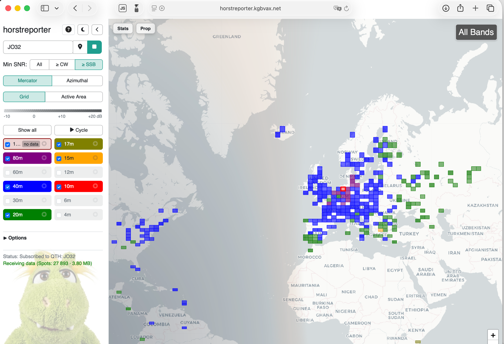

# HorstReporter

HorstReporter is a single Go binary with a plain-ES-modules frontend. It ingests
PSK Reporter MQTT data (`pskr/filter/v2/#`), computes live HF propagation
conditions from an FT8-SNR baseline, and serves a browser UI plus SSE streams.
Optional ingests add DX cluster, RBN, and WSPR data.



You don't need a rig to run it: it reads public spot data and only needs your
locator (a Maidenhead grid square) as its QTH.

## What it does

- Real-time per-band scoring with baseline-aware confidence and status
- Status classes `green | yellow | red | grey`
- Band recommendations (`best_bands`, `recommended_bands`, `worst_bands`,
  `avoid_bands`) and a trend direction with sparkline
- Mode feasibility `ssb | cw | digital | none`
- Dominant direction output (azimuth sector: `N`, `NE`, ...)
- Propagation intelligence: `GET /api/prop_intel/v2` (multi-source nowcast per
  band × region, always from your QTH) plus a 60s-cached `/api/prop_intel/summary`
  that feeds the horstapp mobile widgets

Canonical endpoint reference: [docs/api.md](docs/api.md) (response shapes, caches,
exclusions). Scoring method: [docs/scoring-method.md](docs/scoring-method.md).

## Quickstart

You need Go 1.24+ to build and run. Frontend tests and the typecheck need
Node/npm. Postgres is optional: without a DSN the server falls back to its
in-memory history (persistence, replay baselines and the raw-spot store want
Postgres).

```bash
go run . -dev -port 8080
```

Then open `http://localhost:8080`: a Mercator map of recent FT8 spots around
your locator, with per-band status chips and recommendations. All flags
and their defaults: `go run . -h`.

Tests: `go test ./...` (backend), `npm run check` (frontend typecheck + tests).

## Optional ingests

All optional ingests are disabled by default and enabled via flags; secrets go
through env vars, never argv (see
[docs/deployment-secrets.md](docs/deployment-secrets.md)). Cluster, RBN and WSPR
spots are tagged with a `source_type` and stay out of the FT8-SNR conditions
baseline; only RBN/WSPR contribute to the activity chart and live stream.

```bash
# DX cluster (TCP). Most clusters require a registered callsign and an
# individually-assigned password; login is prompt-aware. Parsed spots persist
# to Postgres dx_raw_spots; only spots with usable locators enter the live map.
DXCLUSTER_USERNAME=<yourcall> DXCLUSTER_PASSWORD=<password> \
  go run . -dev -port 8080 -dxcluster-enable -dxcluster-endpoint db0erf.de:7300

# RBN (Reverse Beacon Network): public CW/RTTY telnet relay, prompts for a callsign
go run . -dev -port 8080 -rbn-enable -rbn-callsign <yourcall>

# WSPR (wspr.live ClickHouse poller): reference-only
go run . -dev -port 8080 -wspr-enable
```

`QRZ_USERNAME` / `QRZ_PASSWORD` enable callsign→locator enrichment, shared by the
DX cluster and RBN ingests.

## Companion tools

- `cmd/horstoperator-agent`: a local agent that bridges the browser's opmode
  runtime to PSTrotator via UDP (built-in command profile, no user templates)
  and, with `-rig-transport`, can also tune the rig via WaveLogGate or Log4OM.
  It resolves Wavelog attributes for the Chase Queue and computes award progress
  ("wanted": DXCC/WAS/POTA) in-process, so the operator's log stays local; it
  is never pulled to the shared server.

  ```bash
  go run ./cmd/horstoperator-agent -listen 127.0.0.1:9955 -station-locator JO62qm
  ```

  The agent's flag matrix and env vars: `go run ./cmd/horstoperator-agent -h`
  and [docs/deployment-secrets.md](docs/deployment-secrets.md). The browser
  contract it serves is specified in
  [docs/dxcluster-agent-api.md](docs/dxcluster-agent-api.md); award progress is
  specified in [docs/horstawards.md](docs/horstawards.md).

- `cmd/horstprop`: a separate HF link-quality scoring service that consumes
  HorstReporter read-only over HTTP and scores individual paths/links. Spec:
  [docs/horstprop.md](docs/horstprop.md).

  ```bash
  go run ./cmd/horstprop -listen 127.0.0.1:9970
  ```

- `../dxlens`: sibling DX-conditions lens module mounted at `/dxlens/`.
- `../horstapp`: sibling Flutter mobile app (iOS primary + Android) that
  consumes this backend read-only, including native home-screen widgets fed by
  `/api/prop_intel/summary`.

## More documentation

- [docs/api.md](docs/api.md): every HTTP endpoint with response shapes, caches
  and explicit exclusions
- [docs/scoring-method.md](docs/scoring-method.md): the DX conditions scoring
  method
- [docs/horstprop.md](docs/horstprop.md), [docs/horstawards.md](docs/horstawards.md):
  specs for the companion tools
- [docs/deployment-secrets.md](docs/deployment-secrets.md): secret/env
  conventions for server and agent
- `CLAUDE.md`: architecture map, command reference and development constraints