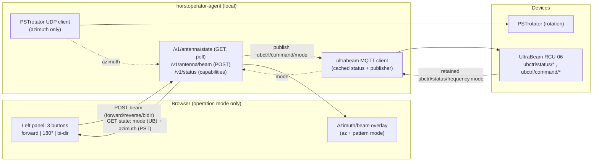
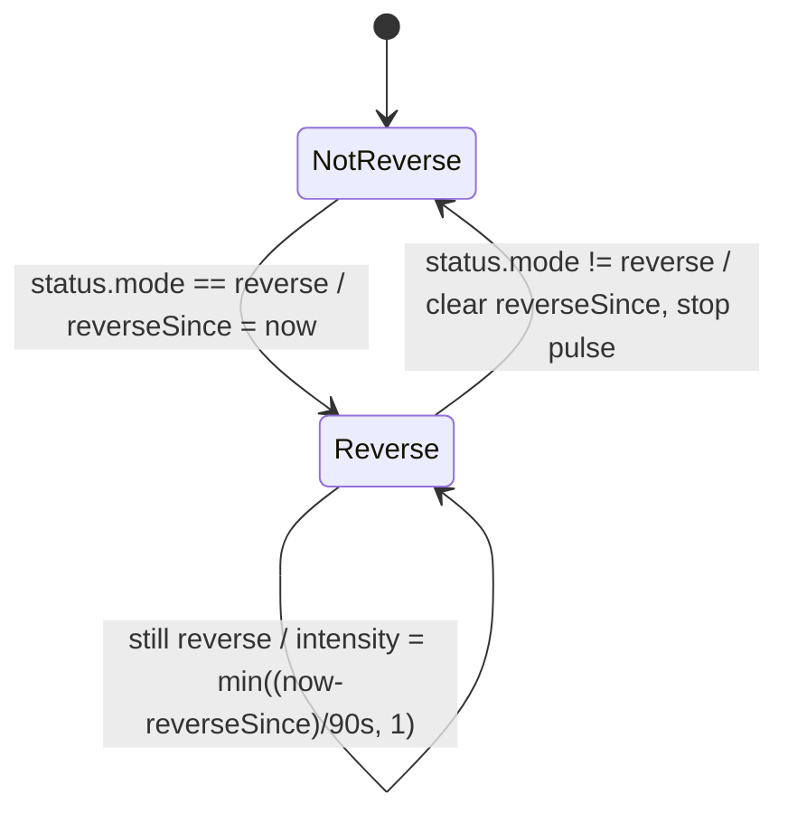

# feat: UltraBeam beam-direction control in operator mode

## Summary

Add live **beam-direction** status and control for the UltraBeam RCU-06 antenna to the operator left panel, active only in operation mode. The integration is done over MQTT against the `ubctrl` topics (documented in `docs/ultrabeam-mqtt-api.md`), and all of it lives in the operator agent (`cmd/horstoperator-agent/`) — the shared backend is untouched and stays read-only.

This **replaces** the existing beam-direction control. Today the panel has a `forward / backward / bidirectional` `<select>` + "Set mode" button that drives the **PSTrotator** (over UDP). Beam direction now comes from and goes to the **UltraBeam** over MQTT instead. The PSTrotator keeps doing **rotation (azimuth)** only.

Three concrete UI changes:

1. The beam-direction control becomes **three buttons in a row**: `forward`, `180°`, `bi-dir` (mapping to ubctrl `forward` / `reverse` / `bidirectional`).
2. The active button reflects the **live UltraBeam status** (from retained MQTT status), not a local guess.
3. When **`180°`** is the active direction, that button **pulses red with intensity ramping up over 90 seconds** — a deliberately escalating alarm because a forgotten reverse state is a known operational footgun.

**Product Contract preservation:** No upstream brainstorm; direct planning (`ce-plan-bootstrap`). Scope was narrowed interactively to beam direction only.

---

## Problem Frame

The UltraBeam RCU-06 can point its pattern forward, reverse (180°), or bidirectional. An operator who leaves the antenna in **180°/reverse** and forgets is a recurring real-world problem: subsequent contacts are worked with the beam pointing the wrong way, and the mistake is silent. The current panel control doesn't even talk to the UltraBeam — it sends a mode to the PSTrotator — so the displayed direction can disagree with the actual antenna.

We want the operator left panel to (a) show the **antenna's true beam direction** sourced from the UltraBeam itself, (b) let the operator set it with one click, and (c) make the reverse state hard to forget via a **persistent reminder** whose visual prominence escalates with how long reverse has been observed in the current session. (The escalation tracks observed duration, not absolute wall-clock since entering reverse — a page reload restarts the ramp; see KTD6 for why that trade-off is acceptable.)

The UltraBeam exposes this over MQTT: retained `ubctrl/status/frequency` carries `mode` (`forward|reverse|bidirectional`), and `ubctrl/command/mode` accepts the same canonical values. See `docs/ultrabeam-mqtt-api.md` §3.1, §4.2, §5.1.

---

## Requirements

- **R1** — In operation mode, the left panel shows the UltraBeam's current beam direction, sourced from live MQTT status (retained `ubctrl/status/frequency.mode`), not from PSTrotator and not from a local-only guess.
- **R2** — The beam-direction control is three buttons in a row: `forward`, `180°`, `bi-dir`, replacing the previous `<select>` + "Set mode" button.
- **R3** — Clicking a button sets the UltraBeam direction by publishing to `ubctrl/command/mode` (`forward` / `reverse` / `bidirectional`). The change confirms by the next status update flipping the active button, fire-and-forget per the ubctrl contract.
- **R4** — The currently-active direction is visually indicated on whichever of the three buttons matches live status.
- **R5** — When the active direction is `180°` (reverse), that button pulses red, and the pulse **intensity increases over a 90-second ramp** from first observed entry into reverse; it then holds at maximum while reverse persists. Leaving reverse stops the alarm and resets the ramp. The alarm must carry a **non-color, non-motion channel** as well (a visible `REVERSE` text cue plus an `aria-live="assertive"` announcement) so it is perceivable by red/green-colorblind operators and under `prefers-reduced-motion` — color/motion alone would fail exactly the operators most likely to leave the beam reversed.
- **R6** — PSTrotator **rotation (azimuth)** control and polling are unchanged. Only beam **direction** moves to the UltraBeam.
- **R7** — The azimuth/beam overlay's pattern `mode` (forward wedge / bidirectional double-lobe / reverse) is driven by the UltraBeam direction so the map overlay matches the real antenna. When the UltraBeam is offline (`beam_online:false`), the overlay must **not** render the `forward` fallback as if authoritative — it suppresses or visibly de-emphasizes the beam-direction pattern (neutral/unknown state) so the map never lies about direction.
- **R8** — All UltraBeam integration lives in the operator agent; the shared backend (`main.go` and siblings at repo root) is not modified. The browser reaches the UltraBeam only through the existing agent-direct `/v1/...` channel.
- **R9** — UltraBeam connection settings (broker URL, client ID, topic prefix, optional username/password, enable flag) are configured via the agent's existing `.env` + flag + tray Settings mechanism.
- **R10** — Beam-direction control obeys the existing operation-mode permission gate (agent `CONTROL_PERMITTED`, server capability, and the "Permit Antenna Control" checkbox). When the UltraBeam is not configured/connected, the control degrades gracefully (status shown as unavailable; buttons disabled). The unavailable status names the cause so the operator knows the remedy: control-not-permitted (tick the checkbox), UltraBeam offline (configured but `online:false`), or UltraBeam not configured — three distinct messages, not one ambiguous greyed-out state.
- **R11** — Control commands remain gated behind `permit_control: true` in the request body, matching the existing rotate/mode endpoints.

---

## Key Technical Decisions

- **KTD1 — UltraBeam integration is a new MQTT client inside the agent.** The agent has no MQTT today (it uses UDP for PSTrotator). Add a small `ultrabeam` client in `cmd/horstoperator-agent/ultrabeam.go` using `github.com/eclipse/paho.mqtt.golang` (already a dependency, `go.mod:8`). Mirror the backend's client-options idiom in `mqtt.go:31-105` (auto-reconnect, unique client ID) but add broker URL + auth, which the backend never needed. This is the repo's first MQTT **publisher** and the agent's first MQTT use of any kind.

- **KTD2 — Subscribe to retained status, cache it, serve over the existing poll endpoint.** Subscribe to `<prefix>/status/#` and keep a cached `ultrabeamState{mode, online, updatedAt, lastErr}` behind a mutex — mirroring the existing `polledAntennaState` cache pattern (`cmd/horstoperator-agent/main.go:507-517`, `593-678`). Retained topics deliver current values immediately on connect (ubctrl API §6). The frontend's existing 3 s poll of `/v1/antenna/state` then carries the UltraBeam mode with no new polling loop.

- **KTD3 — Beam direction's source-of-truth in `/v1/antenna/state` switches from PSTrotator to UltraBeam.** `handleAntennaState` (`main.go:791-828`) currently fills `antenna.mode` from the PSTrotator-polled `rotatorState.Mode`. Change it to fill `mode` from the cached UltraBeam status. Azimuth (`azimuth_deg`), fast-polling, and target stay PSTrotator-sourced and unchanged.
  - **Decouple the two devices' liveness.** Today `handleAntennaState` returns HTTP 502 the moment the PSTrotator poll errors (`main.go:801-805`). That must change: a routine rotator UDP timeout (the agent has dedicated backoff for it) must **not** blank the UltraBeam beam status or silence the reverse alarm — that would defeat the whole "two devices, two transports" independence premise. The endpoint returns `200` with the cached UltraBeam `mode` + `beam_online` whenever UltraBeam state is available, degrading only the azimuth fields (omit/null + an `azimuth_online:false` flag) when the rotator poll is failing. The frontend must tolerate a missing azimuth without dropping the antenna object so the alarm keeps evaluating off UltraBeam status alone.

- **KTD4 — Beam-direction commands get a dedicated agent endpoint that publishes MQTT.** Add `POST /v1/antenna/beam` (publishes to `<prefix>/command/mode`) rather than overloading the PSTrotator `POST /v1/antenna/mode` (`main.go:884-923`). This keeps the two devices' control paths cleanly separated. The frontend's `setAntennaMode` is repointed to the new endpoint. The old PSTrotator `/v1/antenna/mode` handler and PSTrotator `SetMode`/`MODE?` plumbing are left intact but become unused by the UI; their removal is deferred (see Scope Boundaries).
  - **Define a small interface seam for testability.** `handleBeam` must be unit-testable without a live broker, exactly as `handleRigTune` is testable via the existing `rigController` interface (`rig.go:17`). Introduce a `beamController` interface (`Publish(mode) error`, `Status() ultrabeamState`, `Online() bool`) that the concrete `*ultrabeamClient` satisfies, and store it on `server` as `s.ub beamController`. Tests inject a fake that records published payloads. Without this seam the U3 publish-assertion scenario is unbuildable.

- **KTD5 — Vocabulary mapping is centralized.** UI/label/canonical mapping: button `forward` ↔ ubctrl `forward`; button `180°` ↔ ubctrl `reverse`; button `bi-dir` ↔ ubctrl `bidirectional`. The agent speaks ubctrl canonical values on MQTT. The frontend keeps its internal normalized vocabulary but the **reverse** value is now surfaced as `reverse`/`180°` rather than `backward`. Extend `normalizeMode` (`static/opmode.js:35-40`) and the overlay so `reverse` is a first-class value distinct from the legacy `backward`.

- **KTD6 — The 90 s reverse alarm ramp is driven off observed status, not click time.** Track `reverseSince` on the frontend: set it when status first shows `reverse` and it was not already set; clear it when status shows a non-reverse mode. Alarm intensity = clamp((now − reverseSince) / 90 s, 0, 1), applied via a CSS custom property on the `180°` button feeding a pulsing red keyframe. Driving off observed status (not the click) means a page reload or an externally-initiated reverse (Home Assistant, the physical controller) still escalates correctly; the only cost is that the ramp restarts from zero on reload, which is acceptable for an "is it still reverse?" reminder.

- **KTD7 — Capability advertisement gates the UI.** Add an `ultrabeam` entry to the `capabilities` map in `handleStatus` (`main.go:740-753`) reporting whether the UltraBeam client is configured and currently connected/online. The frontend reads it in `refreshOpModeStatus` (`opmode.js:336-366`) and disables the buttons + shows an unavailable status when absent — same shape as the existing `rig` and `lookup` capability gating.

---

## High-Level Technical Design

Beam direction and rotation are now sourced from two different devices over two different transports, composited into one overlay and one panel. Azimuth stays with PSTrotator (UDP); direction moves to UltraBeam (MQTT).

Reverse-alarm state machine (frontend, evaluated each 3 s status poll):

---

## Implementation Units

### U1. UltraBeam MQTT client in the agent

**Goal:** A self-contained MQTT client that connects to the UltraBeam broker, subscribes to retained status, caches the current beam direction + availability, and can publish direction commands.

**Requirements:** R1, R3, R8, R9

**Dependencies:** none

**Files:**
- `cmd/horstoperator-agent/ultrabeam.go` (new) — client type, connect/subscribe/publish, cached state, status accessors
- `cmd/horstoperator-agent/ultrabeam_test.go` (new) — unit tests for status parsing + vocabulary mapping
- `docs/ultrabeam-mqtt-api.md` (reference only; do not edit)

**Approach:**
- Define `ultrabeamClient` holding the paho client, the config (broker URL, client ID, topic prefix, username/password), and a mutex-guarded `ultrabeamState{ mode string; online bool; updatedAt time.Time; lastErr string }`. It satisfies the `beamController` interface (KTD4) so handlers depend on the interface, not the concrete client.
- Connect with `AddBroker(brokerURL)`, a **unique** client ID (default `horstoperator-<nanos>`, never `ubctrl`; ubctrl API §1 warning), `SetAutoReconnect(true)`, optional `SetUsername/SetPassword`. On connect, subscribe to `<prefix>/status/#` (QoS 0).
- Message handler: parse `<prefix>/status/frequency` JSON for `mode`; parse `<prefix>/status/availability` plain string (`online`/`offline`). Update the cached state. Ignore other status topics for now (frequency/band/motors out of scope).
- `Publish(mode)` → publish canonical ubctrl value to `<prefix>/command/mode` non-retained QoS 0.
- Expose `Status() ultrabeamState` and `Online() bool`. **Liveness is anchored on the broker connection, not message recency.** Because ubctrl status is change-driven (an idle, healthy antenna emits nothing for arbitrarily long — ubctrl API §3), a message-recency/`updatedAt` staleness window cannot distinguish "idle-healthy" from "dead": a short window false-flags a healthy idle controller as offline, a long window lets a dead one read online. So `Online()` = paho client `IsConnected()` **AND** last-seen availability ≠ `offline`. `updatedAt` is cached and surfaced for display/diagnostics only, **not** used to flip `Online()`. Document the one residual gap this leaves: a controller that dies *without* publishing `offline` while its broker link stays up will read `online` until the broker drops it — a known, bounded best-effort limit of the no-LWT contract, not something a recency window can fix.
- Centralize the canonical↔internal mapping here (`reverse` is canonical; helpers translate to/from the frontend's value if needed).

**Patterns to follow:** backend MQTT client options in `mqtt.go:31-105` (broker/clientID/auto-reconnect, OnConnect subscribe); cached-state-behind-mutex in `cmd/horstoperator-agent/main.go:507-517, 593-678`.

**Test scenarios:**
- Happy path: a `status/frequency` payload `{"frequency":21225,"band":"15m","mode":"reverse"}` updates cached mode to `reverse`.
- Happy path: `status/availability` = `offline` flips `Online()` to false; `online` flips it back true.
- Edge: malformed/empty status JSON is ignored without panicking and leaves prior cached state intact.
- Edge: unknown `mode` value coerces to `forward` (mirror ubctrl coercion, API §4.2) and is recorded.
- Mapping: internal/UI `180°`/`reverse` maps to canonical `reverse` on publish; canonical `reverse` maps back for status display.
- Edge: `Online()` returns `false` when the broker client is disconnected, and `true` when connected with last availability `online`; an **idle-healthy** controller (connected, no recent status messages) still reads `online` (no false-offline from message-recency).

### U2. Agent config for the UltraBeam connection

**Goal:** Operator-tunable UltraBeam settings wired through the agent's `.env` → flag-default → `serviceConfig` chain and the tray Settings page.

**Requirements:** R9, R10

**Dependencies:** U1

**Files:**
- `cmd/horstoperator-agent/main.go` — add UltraBeam fields to `serviceConfig` (~`:100-123`), env-backed flags + `cfg` assembly (~`:1014-1104`), construct the client in `newServer` (~`:540-566`)
- `cmd/horstoperator-agent/config.go` — add UltraBeam keys to `configFields` (`:37-54`) and `validateConfig` (`:249-289`)
- `run_operator_agent.sh` — document the new env vars in the dev launcher

**Approach:**
- New `serviceConfig` fields: `UBEnabled bool`, `UBBrokerURL string`, `UBClientID string`, `UBTopicPrefix string` (default `ubctrl`), `UBUsername string`, `UBPassword string` (env-only, like `WAVELOG_API_KEY`).
- Flags: `-ub-enabled` (`envBoolOr("UB_ENABLED", false)`), `-ub-broker-url` (`envOr("UB_BROKER_URL","")`), `-ub-client-id` (`envOr`, default empty → client generates `horstoperator-<nanos>`), `-ub-topic-prefix` (`envOr("UB_TOPIC_PREFIX","ubctrl")`), `-ub-username` (`envOr`). Password from `os.Getenv("UB_PASSWORD")` only, never logged.
- In `newServer`, construct `s.ub = newUltrabeamClient(cfg)` only when `UBEnabled && UBBrokerURL != ""`; otherwise leave `s.ub == nil` (capability reports unavailable). Same conditional-construction shape as `s.rig`/`s.wavelog`/`s.awards`.
- `configFields`: add `UB_ENABLED` (bool), `UB_BROKER_URL` (text), `UB_TOPIC_PREFIX` (text), `UB_USERNAME` (text), `UB_PASSWORD` (password, `Secret:true`). Validate broker URL shape when enabled.

**Patterns to follow:** env-backed flag helpers `main.go:45-77`; conditional backend construction `main.go:540-566`; secret-from-env precedent `WAVELOG_API_KEY` (`main.go:1099`, `config.go:49`); awards in-process module config wiring (`main.go:1106-1121`).

**Test scenarios:**
- `validateConfig` rejects `UB_ENABLED=true` with an empty/invalid `UB_BROKER_URL`.
- `validateConfig` accepts `UB_ENABLED=false` regardless of broker fields (disabled = no validation).
- Default topic prefix resolves to `ubctrl` when `UB_TOPIC_PREFIX` is unset.
- `UB_PASSWORD` is sourced from env and is not present in `configFields`-rendered values / not logged. *(Covers R9 secret handling.)*

### U3. Serve UltraBeam direction in state + add the beam command endpoint

**Goal:** `/v1/antenna/state` reports the UltraBeam beam direction; a new `POST /v1/antenna/beam` publishes direction commands; `/v1/status` advertises the `ultrabeam` capability.

**Requirements:** R1, R3, R4, R6, R7, R8, R10, R11

**Dependencies:** U1, U2

**Files:**
- `cmd/horstoperator-agent/main.go` — `handleAntennaState` (`:791-828`), new `handleBeam`, route registration (`:680-695`), `handleStatus` capabilities (`:740-753`)
- `cmd/horstoperator-agent/main_test.go` (root-package test file exists; agent has handler tests in `cmd/horstoperator-agent/*_test.go`) — add `beam_test.go` for the new handler

**Approach:**
- `handleAntennaState`: set the response `antenna.mode` from `s.ub.Status().mode` when `s.ub != nil` (falling back to `forward`/unknown when not connected); keep `azimuth_deg`, `beamwidth_3db_deg`, `fast_polling`, `target_azimuth_deg` exactly as today (PSTrotator). Add `antenna.beam_online` (bool) so the UI can distinguish "unavailable" from "forward". **Do not 502 the whole response on a PSTrotator poll error** (current behavior at `main.go:801-805`): when the rotator poll is failing but UltraBeam state exists, return `200` with `mode` + `beam_online`, omit/null the azimuth fields, and set `azimuth_online:false`. Only return an error when *neither* device has usable state.
- New `handleBeam` (`POST /v1/antenna/beam`): copy the guard block from `handleMode`/`handleRotate` (`main.go:842-855, 891-910`) — method check, `ControlPermitted`, `permit_control` true. Validate `mode ∈ {forward, reverse, bidirectional}`; reject otherwise. Call `s.ub.Publish(mode)`. **Verify the publish rather than assuming success:** MQTT QoS 0 is fire-and-forget, so if the broker link dropped between the 3 s capability poll and the click, the message is silently lost. `Publish` waits on the paho publish token with a short timeout and checks `token.Error()` / connection state; `handleBeam` returns `{ok:true, mode}` only when the publish was enqueued on a live connection, and `502` (`{ok:false, error}`) when it could not be — so the UI can surface "command not sent" instead of a false success. Return `503` when `s.ub == nil`.
- Register `mux.HandleFunc("/v1/antenna/beam", s.handleBeam)`.
- `handleStatus`: add `capabilities["ultrabeam"] = map[string]any{"control": s.ub != nil, "online": s.ub != nil && s.ub.Online()}`.

**Patterns to follow:** existing control-handler guards and JSON envelopes (`handleMode` `main.go:884-923`, `handleRotate` `main.go:835-877`); capability advertisement (`main.go:740-753`).

**Test scenarios:**
- `GET /v1/antenna/state` returns `antenna.mode == "reverse"` when the cached UltraBeam status is reverse; azimuth fields are still PSTrotator-sourced and unchanged.
- *Covers the alarm-independence requirement.* `GET /v1/antenna/state` with a **failing PSTrotator poll** but a live UltraBeam still returns `200` with `mode` + `beam_online:true` and `azimuth_online:false` (no 502) — so the reverse alarm keeps evaluating.
- `POST /v1/antenna/beam` with `permit_control:true, mode:"reverse"` publishes canonical `reverse` and returns `{ok:true,mode:"reverse"}`.
- Error: `POST /v1/antenna/beam` without `permit_control` → 403; with `ControlPermitted=false` agent config → 403.
- Error: invalid `mode:"sideways"` → 400.
- Error: beam endpoint with `s.ub == nil` (UltraBeam disabled) → 503.
- Error: `POST /v1/antenna/beam` when the broker connection is down (publish cannot be enqueued) → 502 `{ok:false}`, not a false 200.
- `GET /v1/status` reports `capabilities.ultrabeam.online=false` when disconnected, `true` when connected. *(Covers R10.)*
- Wrong method (GET on `/v1/antenna/beam`) → 405 with `Allow: POST`.

### U4. Replace the panel control with three beam-direction buttons

**Goal:** Swap the `<select>` + "Set mode" control for three buttons (`forward`, `180°`, `bi-dir`), wired to the new endpoint, with the active button reflecting live status.

**Requirements:** R2, R3, R4, R5 (markup hook only), R7, R10

**Dependencies:** U3

**Files:**
- `static/index.html` — replace the `#opmode-controls-group` block (`:191-198`)
- `static/opmode.js` — repoint `setAntennaMode` to `/v1/antenna/beam`; replace `<select>` sync with button-group sync; extend `normalizeMode`/overlay for `reverse`; wire button clicks in `initOpMode` (`:682-738`)
- `static/app.js` — update the show/hide wiring that targets `#opmode-controls-group` (`:1486-1489, 1752-1757`) if element shape changes
- `static/opmode.test.js` (new, vitest) — mode mapping + active-button selection

**Approach:**
- Markup: three `<button>`s in a row inside `#opmode-controls-group` with stable ids (`opmode-beam-forward`, `opmode-beam-180`, `opmode-beam-bidir`) and a shared class (`opmode-beam-btn`), each carrying a `data-mode` of `forward`/`reverse`/`bidirectional`. Remove `#opmode-antenna-mode` select and `#opmode-antenna-mode-btn`. Lay the row out as an equal-width flex group that **wraps** (rather than overflowing) when the left panel is narrow, with a minimum touch-target size (≥44 px height) so the three text buttons stay tappable on mobile/narrow panels — confirm this inherits from the cited `.btn-check` segmented-group pattern (`index.html:146-163`) rather than assuming it.
- `opmode.js`: replace `syncModeUiFromAntenna` (`:238-261`) with a button-group version that toggles an `active` class on the button whose `data-mode` matches the live `antenna.mode`, and disables all three when control isn't permitted (reuse `syncControlWidgets` `:219-236`, retargeted to the buttons). On click, call `setAntennaMode(button.dataset.mode)`.
- Repoint `setAntennaMode` (`:482-501`) to `opModeEndpoint('antenna/beam')` and send canonical values; keep `permit_control:true`.
- Extend `normalizeMode` so `reverse`/`180`/`180°` → `reverse` (no longer collapsed to `backward`); ensure the overlay (`extractAntenna` `:143-158`, `syncAntennaOverlay` `:263-283`) treats `reverse` as the 180° pattern. *(R7)*
- **Tolerate a missing azimuth.** `extractAntenna` (`:146`) currently returns `null` when azimuth is absent, which would drop the whole antenna object and silence the alarm during a rotator outage. Change it to still return an antenna object carrying `mode`/`beam_online` when azimuth is missing (azimuth-dependent overlay drawing is skipped, but the beam-direction buttons and the reverse alarm keep working). *(supports alarm independence)*
- The heading row (`#opmode-heading`, `:398-405`) keeps showing `azimuth° mode` but `mode` is now UltraBeam-sourced and reads `reverse`.
- Disable buttons + show unavailable when `capabilities.ultrabeam.online` is false. *(R10)*
- **Offline overlay handling.** `syncAntennaOverlay` reads `beam_online`; when false it suppresses or de-emphasizes the beam-direction pattern (neutral/unknown) instead of drawing the `forward` fallback as authoritative. *(R7 — avoids the overlay confidently showing a forward wedge while the buttons say "unavailable")*
- **Cause-specific unavailable copy** near the button row, distinguishing the three states the disabled buttons could mean (the `beam_online` flag plus the capability/permission state already carry enough to pick): `"Antenna control not permitted"` (permit gate off), `"UltraBeam offline"` (configured but `online:false`), `"UltraBeam not configured"` (no client). *(R10)*

**Patterns to follow:** existing `.btn-check`/segmented button groups in the Options panel (`index.html:146-163`); existing control-permission gating (`opmode.js:219-236`); existing click wiring in `initOpMode` (`opmode.js:694-718`).

**Test scenarios:**
- Active-button selection: status `mode:"reverse"` marks the `180°` button active and the other two inactive.
- Click `bi-dir` posts `mode:"bidirectional"` to `/v1/antenna/beam` with `permit_control:true`.
- `normalizeMode("180°")`, `normalizeMode("reverse")`, `normalizeMode("180")` all resolve to `reverse`; `normalizeMode("bi-dir")` → `bidirectional`.
- All three buttons disabled when control not permitted, and when `ultrabeam.online` is false.
- Overlay: `mode:"reverse"` produces the reverse/180° beam pattern (not forward).
- Overlay: `beam_online:false` suppresses/de-emphasizes the pattern rather than drawing a `forward` wedge.

### U5. The 90-second escalating reverse alarm

**Goal:** When `180°` is the active direction, the button pulses red with intensity ramping from 0 to max over 90 seconds, holding at max until reverse is left.

**Requirements:** R5

**Dependencies:** U4

**Files:**
- `static/style.css` — pulsing-red keyframe driven by an intensity custom property
- `static/opmode.js` — `reverseSince` tracking + per-tick intensity update applied to the `180°` button
- `static/opmode.test.js` — intensity/ramp + reset logic

**Approach:**
- CSS: a `@keyframes opmodeReversePulse` that animates the `180°` button's background/box-shadow between a base red and a brighter red, with amplitude scaled by a CSS custom property `--reverse-alarm-intensity` (0–1). Respect `prefers-reduced-motion` by falling back to a static (non-pulsing) red at the current intensity (mirror the reduced-motion guard at `style.css:325`).
- **Non-color cue (required, not just the pulse).** While reverse is active, show a persistent `REVERSE` text label on/beside the `180°` button and announce it via an `aria-live="assertive"` region, so the alarm reads through text regardless of color vision or motion preference. This text cue stays visible in the `prefers-reduced-motion` static-red state, where the pulse is gone and red is otherwise the only signal.
- JS: maintain `opModeState.reverseSince`. On each status refresh (`refreshAntennaState` `:377-408`): if `antenna.mode === 'reverse'` and `reverseSince` is null, set it to `Date.now()`; if mode is not reverse, clear it and remove the pulse. Compute `intensity = clamp((Date.now() - reverseSince) / 90000, 0, 1)` and set `--reverse-alarm-intensity` on the `180°` button; add the pulsing class only while reverse.
- Because status polls every 3 s, the intensity updates in 3 s steps — smooth enough for a 90 s ramp. (Optional: a lightweight rAF/interval for finer ramping is deferred; not required by R5.)

**Patterns to follow:** existing keyframe + reduced-motion patterns (`style.css:17-20, 305-325, 776-802`).

**Test scenarios:**
- *Covers R5.* Entering reverse sets `reverseSince`; intensity at t≈0 is ~0, at t=45 s is ~0.5, at t≥90 s is clamped to 1.
- Leaving reverse clears `reverseSince`, removes the pulsing class, and resets intensity to 0.
- Re-entering reverse after leaving restarts the ramp from 0 (not from the prior value).
- Intensity never exceeds 1 and never goes negative.
- Reduced-motion: with `prefers-reduced-motion`, the `180°` button is statically red (no animation) when reverse is active, **and the `REVERSE` text cue + `aria-live` announcement are still present** (the non-color channel survives motion suppression). *(behavioral expectation; assert the class/style branch and the text cue)*

### U6. Documentation: concepts + info copy

**Goal:** Keep the canonical vocabulary and user-facing docs in sync with the new behavior.

**Requirements:** none directly — satisfies the Definition of Done documentation criterion (CONCEPTS.md + `static/info.md` sync); supports operator comprehension of R1/R6 but no R-ID mandates docs

**Dependencies:** U4, U5

**Files:**
- `CONCEPTS.md` — add a short "UltraBeam / beam direction" entry under Operator tooling
- `static/info.md` (and translated `info.*.md` if the maintainer wants parity — English required, others optional) — note the beam-direction control and the reverse alarm

**Approach:**
- `CONCEPTS.md`: define **Beam direction** (forward / 180°-reverse / bidirectional, sourced from the UltraBeam over MQTT, distinct from PSTrotator rotation) following the existing glossary entry style.
- `static/info.md`: one or two sentences describing the three-button control and the escalating reverse warning, so operators understand the pulsing red is intentional.

**Test expectation:** none — documentation only.

---

## Output Structure

Only `cmd/horstoperator-agent/ultrabeam.go` (+ its test) is a genuinely new file in an existing directory; everything else edits existing files. No new directory hierarchy is introduced, so a full tree is unnecessary.

---

## Scope Boundaries

**In scope:** UltraBeam beam-direction (forward / reverse / bidirectional) live status + control over MQTT, surfaced as three panel buttons with an escalating reverse alarm; agent-side MQTT client, config, and endpoints; overlay pattern sourced from UltraBeam direction.

### Deferred to Follow-Up Work
- **Frequency / band / retract control** from the ubctrl API (`ubctrl/command/frequency|band|retract`, status `frequency`/`motors`). The MQTT client in U1 deliberately leaves room to add these without restructuring.
- **Removing the now-unused PSTrotator `SetMode`/`MODE?` plumbing and `/v1/antenna/mode` endpoint.** Left intact in this plan to minimize risk; a later cleanup PR can delete it once the UltraBeam path is proven in operation.
- **Sub-3-second alarm ramp smoothing** via rAF (the 3 s status-poll cadence satisfies R5).
- **Translated `info.*.md` parity** beyond English, at the maintainer's discretion.

### Out of scope (non-goals)
- Any change to the shared backend (`main.go` root and siblings) — it stays read-only.
- Reading/acting on UltraBeam motor-motion (`moving`) state to block commands. **Justification for deferring:** the ubctrl API advises avoiding new mode commands while `moving` is `true` (§3.2), and flipping to `180°` is itself motion-inducing, so a rapid second click can land a command mid-retune using only this feature's controls. The API does not specify what ubctrl does with a mid-motion command, so this plan does **not** assert it is harmless. The deferral is accepted because (a) the operator workflow is one deliberate direction change at a time, not rapid toggling, and (b) the fire-and-forget contract means a mid-motion command at worst no-ops or re-queues. **If implementation reveals ubctrl mishandles mid-motion commands**, restore `moving` to the U1 cache (it is dropped today) and debounce/disable the buttons while `moving` is true — a contained follow-up, not a redesign.
- Home Assistant discovery topics (informational only in the ubctrl API).

---

## Risks & Dependencies

- **First MQTT use in the agent.** Introduces a new broker connection and the repo's first publisher. Mitigation: reuse the proven paho options from `mqtt.go`; gate entirely behind `UB_ENABLED` so a misconfiguration can't break existing rotor/rig behavior; `s.ub == nil` is a fully-supported state.
- **No Last Will on ubctrl (API §3.3), and status is change-driven (API §3).** A dead controller whose broker link stays up can leave `availability` stuck at `online`, and there is no heartbeat to anchor a recency check on. Mitigation + accepted limit: `Online()` keys on the **broker connection state** plus last-seen `availability`, never on message recency (U1) — this avoids false-flagging an idle-healthy controller as offline. The residual case (controller dies without publishing `offline` while the broker stays connected) is an accepted best-effort limit, documented in U1; closing it would require an active liveness probe, deferred.
- **Retained values cover startup.** A freshly connected subscriber gets current state immediately from retained topics (API §6); no polling loop is added.
- **Vocabulary divergence (`reverse` vs legacy `backward`).** Risk of half-migrated mode strings. Mitigation: centralize mapping (KTD5) and cover it with tests in U1 and U4.
- **Overlay regression.** Re-sourcing overlay `mode` from UltraBeam could mis-render if `reverse` isn't handled where `backward` was. Mitigation: explicit overlay test (U4) for the reverse pattern.
- **Broker reachability differs from PSTrotator reachability.** The agent host must reach the UltraBeam broker. Mitigation: capability `online` flag surfaces disconnection in the UI rather than failing silently.

---

## Verification Contract

- `go test ./...` passes (covers new agent tests: `ultrabeam_test.go`, `beam_test.go`, config validation).
- `npm test` (vitest) passes (covers `opmode.test.js`: mode mapping, active-button selection, reverse-alarm ramp/reset).
- Manual smoke in `-dev` against a test broker: with `UB_ENABLED=true`, the panel shows the live direction; clicking each button retunes the UltraBeam and the active button follows status; `180°` pulses red and visibly intensifies toward the 90 s mark; leaving `180°` stops it; PSTrotator rotation still works independently.
- With `UB_ENABLED=false`, the panel shows the beam control as unavailable/disabled and no MQTT connection is attempted; rotor + rig behavior is unchanged.

## Definition of Done

- R1–R11 satisfied and exercised by the test scenarios above.
- UltraBeam beam direction is sourced from MQTT status and controlled by publishing to `ubctrl/command/mode`, entirely within the operator agent.
- The three-button control replaces the old select/button; the active button reflects live status; the `180°` alarm ramps over 90 s and resets correctly.
- PSTrotator rotation is untouched; the shared backend is unmodified.
- `go test ./...` and `npm test` green; manual smoke (both enabled and disabled) verified.
- `CONCEPTS.md` and `static/info.md` updated.

---

## Sources & Research

- `docs/ultrabeam-mqtt-api.md` — authoritative ubctrl MQTT contract (topics, payloads, vocabulary, no-LWT caveat).
- Existing agent control pattern: `cmd/horstoperator-agent/main.go` (config `:100-123`, routes `:680-695`, handlers `:733-923`, cached-state `:507-517, 593-678`, flags/cfg `:1014-1140`), `cmd/horstoperator-agent/config.go` (`:20-54, 249-372`).
- Backend MQTT idiom (subscribe-only today): `mqtt.go:31-105`; paho dependency `go.mod:8`.
- Frontend opmode: `static/opmode.js` (detection/gating `:64-85`, capabilities `:336-366`, mode UI `:238-261`, command `:482-501`, init `:682-738`), `static/index.html:181-204`, `static/app.js:1486-1489, 1752-1757`.
- CSS animation/reduced-motion patterns: `static/style.css:17-20, 305-325, 776-802`.
- Domain vocabulary: `CONCEPTS.md` (Operator tooling, `horstoperator-agent`).
