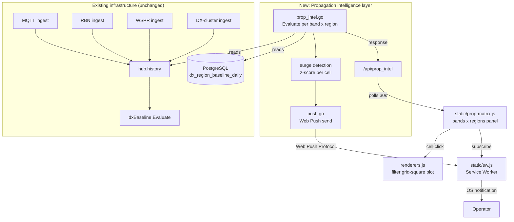

## Goal Capsule

- **Objective:** Build a QTH-agnostic propagation intelligence layer for horstreporter that fuses RBN, PSKREPORTER, and WSPRnet into per-(band × named-region) P(open) and expected count, surfaced as a nowcast plus 1-hour extrapolation in a bands × regions matrix, with surge detection driving in-app highlight and mobile push alerts.
- **Product authority:** This plan owns the propagation intelligence layer only. Surrounding horstreporter capabilities (existing grid-square plot, data ingest, user auth, station profile) are not active scope; the intelligence layer consumes data already mirrored by horstreporter and emits a new view + alert channel.
- **Execution profile:** Extend the existing single-binary Go backend with a new computation engine + endpoint, a new frontend panel mirroring the existing WSPR matrix pattern, and a Web Push notification channel. No new ingests, no sibling binary, no data schema migration.
- **Stop conditions:** All six implementation units pass their test scenarios; the four acceptance examples are verified at the API or UI level; `go test ./...` and `npm test` are green.
- **Tail ownership:** This plan's tail (docs, accounting, integration verification) is owned by U6.

Product Contract unchanged. The deferred-to-planning questions are resolved as KTDs in the Planning Contract.

---

## Product Contract

### Summary

A propagation intelligence layer that fuses three spot networks into a per-(band × named-region) nowcast and 1-hour forecast, surfaced as a bands × regions matrix overlaying horstreporter's existing grid-square plot. Each cell carries P(open) and expected contact count; surges trigger in-app highlight and mobile push. The implementation extends the existing DX baseline engine and region taxonomy, adds a new computation engine + endpoint, a new frontend panel mirroring the existing WSPR matrix, and a Web Push notification channel.

### Problem Frame

Horstreporter today plots the number of DX stations reachable from the operator's QTH per grid square — a useful raw view, but not actionable intelligence. Its WSPR matrix panel aggregates WSPR spots by region, but it is WSPR-only, has no P(open) or expected-count computation, no fusion with RBN/PSKREPORTER, no baseline comparison, no nowcast/forecast, and no surge detection. The operator still has to judge whether a band is open or just sparse, and decide which broad direction and which band to call without any notion of probability or surge. Existing external tools (PSKREPORTER maps, RBN dashboards, VOACAP climatology) are either pin-maps with no intensity aggregation, climatological without real-time correction, or binary open/closed with no directional component. No tool fuses live spot-derived intensity by band × region with nowcasting and surge alerts from the operator's QTH. This layer closes that gap.

### Key Decisions

- **Two-value output: P(open) + expected count.** Chosen over a single intensity scalar because it answers both "is it open?" and "how many QSOs?" Governs R2. (session-settled: user-directed — chosen over P(at least one contact) per window and over expected contact count alone)
- **Named regions + sub-regions as the primary aggregation view, over grid squares.** Operators think in regions; grid squares remain the data substrate and the drill-down target, not the matrix surface. Governs R8, R9, R10. (session-settled: user-directed — chosen over azimuth sectors only and over grid-square primary)
- **Matrix primary, drill-down to grid-square plot.** The bands × regions matrix is the at-a-glance surface; clicking a cell filters horstreporter's existing grid-square plot to that band × region. Governs R11, R12, R13. (session-settled: user-directed — chosen over azimuthal map primary; refined from earlier "matrix + map drill-down" after the user clarified horstreporter already uses grid squares as its primary surface)
- **Nowcast + 1-hour extrapolation.** Chosen over nowcast-only and over 1–4h forecast — favors the reliability of the surge moment over pre-contest pre-positioning. Governs R5, R6, R7. (session-settled: user-directed — chosen over nowcast only and over 1-4h)
- **RBN + PSKREPORTER + WSPRnet as v1 fusion sources.** NOAA SWPC, ionosondes, KiwiSDR, and contest log archives are deferred to phase 2. Governs R1, R3, R4. (session-settled: user-directed)
- **In-app highlight + mobile push for surges.** Chosen over in-app-only and over desktop toast — reaches the operator even when away from the radio. Governs R15, R16, R17. (session-settled: user-directed)
- **All three use cases co-equal in v1, no specialized contest mode.** Everyday operating, contest, and DXpedition/rare-DX contexts share one engine; contest-aware multiplier logic is deferred. The 1-hour forecast horizon serves surge-moment detection (useful in all three contexts) but does not serve contest pre-positioning, which requires multi-hour forecasts (deferred to v2). Contest operators benefit equally from surge detection; the deferral affects only pre-positioning, not the core engine. (session-settled: user-directed)
- **Per-user QTH, multi-operator.** Any ham can point the engine at their location; not a personal single-user tool. Governs R18, R19. (session-settled: user-directed)

### Requirements

**Data fusion**

- R1. The layer ingests spot data from RBN, PSKREPORTER, and WSPRnet already mirrored by horstreporter, plus WSPRnet spots sourced for this layer.
- R2. The layer computes, for each (band × named-region × time window), two scalars: a P(open) value in [0,1] and an expected contact count expressed as spots/hour (per-hour rate).
- R3. WSPRnet is fused as a contributing source but the layer must produce estimates even when WSPRnet activity is sparse in a region; no estimate may depend solely on WSPRnet presence.
- R4. The fusion normalizes across the three sources' differing activity densities so that a region with only WSPRnet spots and a region with dense RBN spots are comparable on the same P(open) / expected-count scales.

**Nowcast and forecast**

- R5. The layer produces a nowcast for a 0–15 minute window per (band × region).
- R6. The layer produces a 1-hour extrapolation per (band × region) derived from spot-rate derivatives over trailing windows.
- R7. Each P(open) and expected-count value carries a confidence indicator reflecting sample size and source coverage for that cell.

**Region taxonomy**

- R8. Regions are named geographic aggregations (e.g., North America, Europe, Africa, Asia, South America, Oceania) with optional sub-region decomposition (e.g., NA east coast, Eastern Europe).
- R9. Each grid square in horstreporter's existing plot maps to exactly one region and one sub-region at the chosen granularity.
- R10. The region taxonomy is configurable per operator or inherits a sensible default; the matrix renders the active taxonomy.

**Matrix surface**

- R11. The primary surface is a bands × regions matrix where rows are bands and columns are regions (or sub-regions when zoomed).
- R12. Each matrix cell encodes both P(open) and expected count — one as cell background intensity, the other as a numeric badge or overlay.
- R13. Selecting a matrix cell drills down to horstreporter's existing grid-square plot filtered to that band × region.

**Surge detection and alerts**

- R14. The layer detects surges: a statistically significant increase in spot rate for a (band × region) relative to a trailing baseline (z-score or equivalent anomaly threshold).
- R15. When a surge is detected, the matrix cell is highlighted in-app with a visible indicator.
- R16. When a surge is detected, a mobile push notification is sent to the operator, configurable per band and/or region threshold.
- R17. The surge alert message identifies the band, region, and detected change (e.g., "tune to 10m, surge to Caribbean").

**Multi-operator and QTH**

- R18. The layer accepts a QTH (Maidenhead grid or lat/lon) and station profile as input and produces all estimates relative to that QTH.
- R19. Any operator can configure their own QTH; the engine is not hardcoded to a single station.

### Actors

- A1. **Operator** — a licensed ham radio operator who configures their QTH and station profile, views the matrix, and receives surge alerts.
- A2. **Horstreporter data layer** — the existing system that mirrors RBN and PSKREPORTER spots and renders the grid-square plot; the intelligence layer consumes its data and emits views back into it.

### Key Flows

- F1. **Nowcast rendering**
  - **Trigger:** Operator opens the matrix view.
  - **Actors:** A1, A2
  - **Steps:** The layer pulls recent spots (trailing window) from the three sources for the operator's QTH; fuses them into per-(band × region) P(open) + expected count; renders the matrix with intensity backgrounds and badges.
  - **Covered by:** R1, R2, R4, R5, R8, R11, R12, R18
  - **Outcome:** Operator sees at-a-glance which bands and directions are open and how strongly.

- F2. **Surge alert**
  - **Trigger:** The layer detects a z-score anomaly for a (band × region) cell.
  - **Actors:** A1, A2
  - **Steps:** The cell is highlighted in the open matrix view; if the operator has push enabled for that band/region, a mobile notification fires with the band, region, and surge label.
  - **Covered by:** R14, R15, R16, R17
  - **Outcome:** Operator is prompted to retune even if not actively watching the screen.

- F3. **Drill-down to grid squares**
  - **Trigger:** Operator selects a matrix cell.
  - **Actors:** A1, A2
  - **Steps:** The existing grid-square plot is filtered to the selected band and region; the underlying spots contributing to that cell's estimate are shown.
  - **Covered by:** R9, R13
  - **Outcome:** Operator can inspect the fine-grained evidence behind a matrix cell.

- F4. **1-hour forecast**
  - **Trigger:** Operator operator requests the forecast view or the matrix renders a forward projection column.
  - **Actors:** A1, A2
  - **Steps:** Spot-rate derivatives over trailing windows are extrapolated 1 hour ahead per (band × region); P(open) and expected count for the forecast window are rendered with a confidence indicator.
  - **Covered by:** R6, R7, R12
  - **Outcome:** Operator sees which currently-open bands are intensifying or fading in the next hour (trend-continuation forecast, not opening-prediction).

### Acceptance Examples

- AE1. **Sparse WSPRnet region**
  - **Covers R3, R4.**
  - **Given:** A region (e.g., central Africa) with only two WSPRnet spots in the trailing window and no RBN or PSKREPORTER spots.
  - **When:** The layer computes the nowcast for that region on a band.
  - **Then:** The cell still produces a P(open) and expected count, with a low confidence indicator; the estimate is not zero and not absent. The sparse region's P(open) and expected count are on the same scale as a dense RBN region's values (both in [0,1] for P(open) and spots/hour for expected count), not off-scale or NaN.

- AE2. **Surge on 10m to the Caribbean**
  - **Covers R14, R15, R16, R17.**
  - **Given:** 10m spot rate to the Caribbean region rises from a baseline of 2/hour to 18/hour in the trailing 30 minutes.
  - **When:** The layer runs surge detection.
  - **Then:** The 10m × Caribbean cell is highlighted in the matrix, and a push notification "tune to 10m, surge to Caribbean" is sent to operators with push enabled for that band/region.

- AE3. **Drill-down preserves grid fidelity**
  - **Covers R9, R13.**
  - **Given:** The operator selects the 20m × Europe cell in the matrix.
  - **When:** The drill-down view opens.
  - **Then:** Horstreporter's grid-square plot shows only grid squares mapped to Europe on 20m, with the spot counts that fed the cell's estimate.

- AE4. **Forecast confidence flagged**
  - **Covers R6, R7.**
  - **Given:** A region with sparse trailing data and high spot-rate volatility.
  - **When:** The 1-hour forecast is rendered for that cell.
  - **Then:** The forecast value is shown with a low-confidence indicator distinct from a high-confidence cell.

- AE5. **QTH-relativity**
  - **Covers R18, R19.**
  - **Given:** Two operators with different QTHs (e.g., Berlin JO62 and New York FN31) query the same band × region (20m × Europe).
  - **When:** Both receive their respective matrix responses.
  - **Then:** The Berlin operator sees higher P(open) and expected count for Europe (local region) than the New York operator, whose 20m × Europe cell reflects the longer path. Both values are valid and on the same scale.

### Scope Boundaries

**Deferred for later (phase 2 fusion):**

- NOAA SWPC solar/geomagnetic feeds (Kp, Ap, F10.7, MUF, D-RAP, alerts JSON) as nowcast triggers and priors.
- Ionosonde foF2/MUF data from the GIRO network.
- KiwiSDR / WebSDR reception-quality fusion for blind-spot regions.
- Public contest log archives (CQ WW, ARRL DX, 3830s) for historical per-band/region/hour rate baselines.

**Deferred for later (capability):**

- Forecasts beyond 1 hour (1–4h, 24h WSA-Enlil-driven planning).
- Contest-aware multiplier logic and "move now" contest-specific suggestions.
- Grid squares as the primary matrix surface and multi-resolution zoom.
- Sub-region decomposition (NA east coast, Eastern Europe) — the v1 default uses the existing 11-region DXPulse taxonomy.
- Operator-configurable region taxonomy (v1 uses the fixed 11-region default).
- Per-band/region surge threshold overrides (v1 uses a single operator-wide threshold).
- PG-backed push subscription persistence (v1 is in-memory).
- horstoperator-agent native OS notification relay (v1 uses Web Push directly).
- Hybrid fusion: dedupe across sources but weight by receiver count within a source (v1 deduplicates to unique-sender boolean, discarding within-source receiver-count signal).
- Opening-prediction forecast via leading indicators (v1 forecast is trend-continuation only).

**Outside this product's identity:**

- Replacing horstreporter's existing grid-square plot or data ingest.
- A standalone propagation prediction product separate from horstreporter.

### Dependencies / Assumptions

- Horstreporter's existing RBN and PSKREPORTER mirror is accessible to the intelligence layer as a data source.
- WSPRnet spot data can be ingested at a volume and latency compatible with a 0–15 minute nowcast window.
- The operator's QTH and station profile are available to the layer (configured in horstreporter or provided to this layer).
- P(open) and expected count can be calibrated from historical spot data without a separate climatological prior in v1; VOACAP climatology as a prior is deferred to phase 2 alongside SWPC.

### Outstanding Questions

- **Resolve Before Planning:** None.
- **Deferred to Implementation:**
  - Exact Poisson rate-to-P(open) smoothing constants (tunable during implementation, not a planning-time fork).
  - Confidence formula thresholds (unique sender count and source diversity cutoffs) — calibrate against historical data from `dx_region_baseline_daily` to verify the high/low distribution is not degenerate before shipping.
  - Web Push VAPID key provisioning (operational concern, not a design fork).

### Sources / Research

- PSKREPORTER (pskreporter.info) — pin-map, no intensity aggregation, no prediction.
- Reverse Beacon Network (reversebeacon.net) — CW Skimmer spots, listener-side coverage gaps.
- WSPRnet (wsprnet.org) — weak-signal SNR spots, true scalar signal-strength measure, lower activity density.
- VOACAP "Real Propagation Visualized with FT8" (voacap.com/visualprop) — ITU-zone-to-ITU-zone spot-count heatmaps from HamSCI data; climatological, not real-time.
- DX Atlas + HamCAP — desktop atlas with VOACAP front-end; Windows-only, static, no live spot overlay.
- HamSCI (hamsci.org) — academic citizen-science, FT8 propagation datasets; potential data partner for phase 2.
- Cross-domain analogies: weather radar nowcasting (reflectivity × azimuth × range, storm-cell tracking), stock unusual-activity alerts (z-score anomaly), surf/wind forecast dashboards (spot-located, multi-model, confidence bands).

**Codebase research (Phase 1):**

- `dx_conditions.go` — existing DX baseline engine; `Evaluate(qth, surroundings, minutes, cwMinDb, history, now)` at line 643 produces per-band Score (0–100), Status, Trend, Sparkline, RegionCounts, BaselineActivity, Confidence. Two-tier fallback (cluster → global). The intelligence layer reuses this engine's scoring formula and baseline infrastructure.
- `hot_bands.go` — existing "surprise"/"dx_surge"/"rising" recommender; the closest analog to surge detection. Thresholds at lines 12–24.
- `dx_regions.go` — 11-region DXPulse taxonomy (`dxPulseAllRegions`); bounding-box classifier `dxPulseRegionForLatLng`. Mirrored in `internal/region/region.go`, `internal/proplab/region.go`, and `static/utils.js` (`regionForLocatorCached`).
- `dx_postgres.go:1812` — `regionCalendarStats` computes per-(region × band × slot) p25/p50/p75/mean/stddev from `dx_region_baseline_daily`. This is the existing region-level baseline data source.
- `hub.go` — in-memory rolling history; `broadcastWSPRToAll` sends WSPR spots to all clients (global reference). `broadcastMsg` sends QTH-filtered spots.
- `spot.go` — `MQTTMessage` struct (unified spot representation), `matchAndCreateSpot` (QTH matching), `locatorClusterAnchor` (6×6 cluster math).
- `wspr-matrix.js` — existing band × region matrix panel (client-side WSPR aggregation); the closest frontend template.
- `band-lab.js` — panel with backend polling, in-flight dedup, cache, canvas charts; template for a polling panel.
- `hot-band-indicator.js` — polling indicator pattern (30s interval, AbortController).
- `renderers.js:467` — `aggregateGridSquares` filters by `minSnrMode`/`enabledBands`/`selectedBand`; extendable to also filter by region.
- `main.go:436–444` — `appMux.HandleFunc` list; new endpoints appended here.
- `server.go` — handler pattern: `resolveQTHQuery` → parse params → `hub.RLock` → history copy → `Evaluate` → JSON encode.
- `CLAUDE.md` — "Don't split the core backend into microservices; it is intentionally single-service/single-binary." Multi-station band/region conditions analytics belong in horstreporter core; per-spot/path link scoring belongs in `cmd/horstprop`.
- `docs/plans/2026-08-09-wspr-visualization.md` — the precedent plan for a frontend-only propagation-intelligence surface.

---

## Planning Contract

### Key Technical Decisions

- KTD1. **Region taxonomy: ship the existing 11-region DXPulse set as the v1 default.** The 11-region set (EU, NA, SA, AF, AS, OC, JA, VK, KH6, CAR, AN) already exists in four synced code locations (`dx_regions.go`, `internal/region/region.go`, `internal/proplab/region.go`, `static/utils.js`). Sub-region decomposition (the brainstorm's "optional" clause in R8) is deferred to v2. The taxonomy is not operator-configurable in v1 — all operators see the same 11 regions. Governs R8, R9, R10. (session-settled: user-directed — chosen over sub-regions in v1 and over a configurable taxonomy)

- KTD2. **P(open) calibration: Poisson rate model from unique-sender counts, with region-level baseline from `dx_region_baseline_daily`.** P(open) = 1 − e^(−λ) where λ = expected_spot_rate × window_fraction. The expected spot rate is computed per (band × region) from unique sender locators in the trailing window, deduplicated across all three sources. This satisfies R3 (sparse WSPRnet: low λ → low but nonzero P(open)) and R4 (unique-sender deduplication normalizes across sources' differing activity densities). When PG is available, the region-level baseline from `dx_region_baseline_daily` (`regionCalendarStats`) provides the historical expected rate; when PG is not available, the trailing-window rate itself serves as the nowcast rate and the baseline is derived from the full history window. Governs R2, R3, R4. (session-settled: user-directed — chosen over a separate rate-threshold heuristic and over reusing the existing per-band 0–100 Score normalized to [0,1], because the per-band Score does not decompose by region)

- KTD3. **Surge z-score threshold: default 2.0, operator-configurable via query parameter.** The surge detector computes z = (live_rate − baseline_rate) / baseline_stddev per (band × region). The baseline rate and stddev come from `dx_region_baseline_daily` (PG) or from a trailing 6-hour rate (memory fallback). A minimum-sample guard suppresses surge detection when the baseline has fewer than 30 samples — a stddev from very few samples is statistically meaningless and would produce unstable z-scores for rare band/region combinations. The default z ≥ 2.0 is operator-configurable via the `surge_threshold` query parameter on `/api/prop_intel`; per-band/region overrides are deferred to v2. Governs R14. (session-settled: user-directed — chosen over a fixed non-configurable threshold and over per-band/region overrides in v1)

- KTD4. **Mobile push delivery: Web Push API (Service Worker + Push API).** The browser registers a Service Worker, subscribes to the Push API, and sends the subscription to `/api/push/subscribe`. The backend stores subscriptions in an in-memory map keyed by subscription endpoint, alongside the operator's QTH and band/region preferences. When surge detection fires, the backend iterates subscriptions matching the (band, region) and sends a push via the Web Push Protocol using `github.com/SherClockHolmes/webpush-go`. The Service Worker receives the push event and displays a OS-level notification ("tune to 10m, surge to Caribbean"). VAPID keys are provided via flags/env vars. This reaches the operator even when the browser tab is closed, on desktop browsers and iOS Safari when installed as a Home Screen PWA. The horstoperator-agent could relay to native OS notifications as a v2 enhancement. Governs R16, R17. (session-settled: user-directed — chosen over in-app-only and over desktop toast)

- KTD5. **Fusion normalization: unique-sender deduplication across all three sources.** Rather than weighting sources by inverse activity density, the engine counts unique sender locator hashes per (band × region × window) across RBN, PSKREPORTER, and WSPRnet. A station spotted by both RBN and PSKREPORTER counts once. This naturally normalizes: dense sources don't dominate, sparse sources still contribute. The source diversity (how many of the three sources contributed) feeds the confidence indicator. **v1 limitation:** unique-sender deduplication discards within-source receiver-count signal — a sender heard by 5 skimmers counts the same as one heard by 1 skimmer. A hybrid approach (dedupe across sources, weight by receiver count within a source) is a v2 enhancement. Governs R4. (session-settled: user-directed — chosen over source-weighted aggregation)

- KTD6. **Forecast method: spot-rate derivative extrapolation from trailing sparkline bins (trend-continuation, not opening-prediction).** The nowcast uses the trailing 15-minute window rate. The 1-hour forecast extrapolates from the slope of the trailing sparkline (the existing 12-bin activity sparkline from `Evaluate` provides the rate trend). The forecast rate = nowcast_rate + slope × forecast_horizon, clamped to [0, ∞). P(open) for the forecast window uses the forecast rate in the same Poisson formula. Forecast confidence is lower than nowcast confidence and degrades with forecast horizon and sparkline volatility (variance of bin deltas). **Known limitation:** a band opening is an inflection event — the sparkline is flat before it starts, so the forecast provides zero advance warning for new openings. The v1 forecast's value is identifying which currently-open bands are intensifying or fading, not predicting new openings. Opening-prediction requires a leading indicator (e.g., MUF change, upstream-band opening cascade) deferred to v2. Governs R6, R7. (session-settled: user-directed — chosen over a separate ARIMA or Kalman filter model)

- KTD7. **Architecture boundary: extend the core binary, not a sibling service.** Per `CLAUDE.md`, multi-station band/region conditions analytics belong in horstreporter core. The propagation intelligence engine is a new file in the main package (`prop_intel.go`), wired into the existing `appMux` and consuming the existing `hub.history` + `dxBaseline`. No new binary, no reverse proxy, no new PG table (uses existing `dx_region_baseline_daily`). Web Push subscriptions are in-memory (v1); a PG table is a v2 enhancement. Governs R1, R18. (session-settled: user-directed — chosen over a sibling binary like horstprop/pathscope)

### High-Level Technical Design

The engine operates on a copy of `hub.history` (same binary-search-copy pattern as every other handler). For each spot in the window, it resolves the remote locator to a region via `dxPulseRegionForLocator` (existing), groups by (band × region), counts unique sender locators, and computes the Poisson P(open). The `dxBaseline.Evaluate` provides the per-band sparkline (12 bins) whose slope feeds the forecast. Surge detection runs after the nowcast, comparing each cell's live rate against the region-level baseline from `dx_region_baseline_daily` (when PG is available) or a trailing 6-hour rate (memory fallback).

### Sequencing

U1 is the foundation (engine + endpoint). U2 depends on U1 (surge is part of the response). U3 depends on U1+U2 (needs the full endpoint payload). U4 depends on U3 (drill-down is triggered from the matrix panel). U5 depends on U2 (push is triggered by surge) and U3 (subscription UI lives in the panel). U6 is the final cross-cutting unit (docs, accounting, integration).

### Assumptions

- The `dx_region_baseline_daily` table is populated when PG is configured (the existing `dx_postgres.go` batch flush writes to it). When PG is not configured, the engine falls back to a memory-only mode where baselines are derived from the history window.
- Web Push requires HTTPS in production (horstreporter already supports TLS via `-cert`/`-key` or `-domain`).
- The Service Worker is served from the static file root (`static/sw.js`) and registered only when push is enabled by the operator.
- The existing 11-region taxonomy is adequate for v1; operators who need finer granularity wait for v2 sub-region decomposition.

### System-Wide Impact

**Affected entry points:**
- New HTTP endpoints: `/api/prop_intel`, `/api/push/vapid-public-key`, `/api/push/subscribe`, `/api/push/unsubscribe` — appended to the `appMux.HandleFunc` list in `main.go:436–444`. No existing endpoint changes.
- Existing endpoint `/api/stats` gains two new counter blocks (`prop_intel.*`, `push.*`) in the JSON output. The response shape is additive — existing consumers are not broken.
- Existing `aggregateGridSquares` in `renderers.js:467` gains two optional filter parameters (`filterBand`, `filterRegion`). When both are empty (the default), behavior is unchanged. The filter is only active during drill-down.

**Data lifecycle:**
- Push subscriptions are in-memory (v1). A server restart loses all subscriptions; operators must re-enable push. A PG-backed subscription table is a v2 enhancement. No impact on existing data — the intelligence layer reads `hub.history` (in-memory) and `dx_region_baseline_daily` (existing PG table, read-only).
- No new PG tables, no schema migration, no data backfill. The plan is zero-migration for the database.

**Performance posture:**
- `/api/prop_intel` runs the same history-copy pattern as `/api/dx_conditions` (binary-search cutoff + copy under RLock). The engine iterates the history window once per request, grouping by (band × region). For a 15-minute window with ~1000 spots, this is negligible. The `regionCalendarStats` PG query is the same one DXLens already runs; the existing TTL cache pattern (60s) should be considered for the prop_intel endpoint if request volume is high (30s polling per client).
- Web Push sends are synchronous in the surge path. A failed push (endpoint expired, network error) must not block the `/api/prop_intel` response — push errors are logged and counted, not propagated to the HTTP response.

**Security surface:**
- VAPID private key is a server secret (env var or flag). It must not be logged or exposed via any endpoint. Push error logging must redact Authorization headers and VAPID key material. The `/api/push/vapid-public-key` endpoint must serve only the public key, never the private key. The public key is safe to serve at `/api/push/vapid-public-key`.
- Push subscription endpoints are operator-provided URLs from browser push services (FCM, Apple, Mozilla). The backend sends to these URLs; it does not receive from them. Validate that the subscription endpoint URL is an HTTPS URL before storing.
- The `/api/push/subscribe` endpoint accepts a JSON body from the browser. Validate the subscription shape (endpoint, keys.p256dh, keys.auth) before storing. Reject malformed subscriptions with 400.
- The app is unauthenticated by design (consistent with existing endpoints like `/api/stream`). The push subscribe/unsubscribe endpoints have no auth gate. Mitigate abuse via per-client-IP rate limiting on `/api/push/subscribe` (e.g., max 10 subscriptions per IP per hour). A max-subscription cap (e.g., 1000 total) with FIFO eviction prevents unbounded memory growth. No CSRF mitigation is needed for v1 since the endpoints accept JSON (not form-encoded) and the app has no auth state to exploit.

**Shared infrastructure:**
- New Go dependency `github.com/SherClockHolmes/webpush-go` — added to `go.mod`/`go.sum`. Review the dependency for transitive deps and license compatibility (MIT).
- New static files: `static/sw.js` (Service Worker), `static/push.js` (push registration UI). The Service Worker scope is the app root (`/`); it must not intercept existing requests (only handle `push` and `notificationclick` events).
- The existing `static/renderers.js` is modified — the change is additive (new optional filter parameters), not a refactor of the existing rendering logic.

### Risks & Dependencies

| Risk | Mitigation |
|---|---|
| Web Push browser support varies (Safari on iOS 16.4+ only, Firefox requires user gesture for subscription) | Feature-detect `serviceWorker` and `PushManager` in `push.js`; hide the push enable UI when unsupported. Do not block the matrix panel on push support. |
| iOS Safari requires Home Screen PWA install for Web Push — a plain Safari tab does NOT support Push API even when feature-detection reports availability | Add a UI hint in `push.js` prompting the operator to "Add to Home Screen" before enabling push on iOS. Feature-detection alone does not catch this. |
| VAPID key provisioning is an operational step the operator must perform once | Document key generation in `docs/api.md` and in the push settings UI (a "Generate keys" link to instructions). Provide a `scripts/generate-vapid-keys.sh` helper using `webpush-go`'s key generation. |
| Push subscription endpoints expire (browser uninstalls, permission revocation) — sending to an expired endpoint returns 410 Gone | The `pushStore.NotifySurges` path must handle 410/404 responses by removing the subscription from the store. Retry on 5xx with exponential backoff (max 3 attempts). |
| Server restart loses all in-memory push subscriptions; browser-side subscription persists but server has no record — operator silently loses push coverage | On panel open, the frontend checks whether a subscription is registered server-side and re-POSTs it to `/api/push/subscribe` if missing (idempotent re-subscription). Surface a "push disabled — re-enable" indicator when the server reports zero subscriptions. |
| `regionCalendarStats` returns empty or very few samples for a (band × region × slot) — stddev from <30 samples is statistically meaningless | Suppress surge detection for cells with fewer than 30 baseline samples. Fall back to a trailing 6-hour rate excluding the live 15-minute window (so the signal does not contaminate the baseline). Document sparse-cell behavior as a known limitation. |
| Service Worker caching stale app code after an update | Use a cache-busting version string in the Service Worker registration URL (`static/sw.js?v=1`). On update, the browser re-registers the new version. Existing push subscriptions survive SW updates. |
| `go.mod` dependency adds transitive deps that conflict with existing ones | Run `go mod tidy` and `go build` after adding the dependency; verify no version conflicts in `go.sum`. |
| High request volume on `/api/prop_intel` (many operators polling 30s) stresses PG `regionCalendarStats` queries | Consider a 60s TTL cache on the region baseline query (same pattern as `dxlensProvider.Snapshot`). This is an implementation-time optimization; the plan does not mandate it for v1. |
| Unbounded in-memory subscription store growth from unauthenticated POST abuse | Per-client-IP rate limiting on `/api/push/subscribe` (max 10/hour). Max-subscription cap (1000) with FIFO eviction. |

---

## Implementation Units

### U1. Propagation intelligence engine + `/api/prop_intel` endpoint

**Goal:** Compute per-(band × region) P(open), expected count, and confidence for a nowcast window and 1-hour forecast, served as a JSON endpoint.

**Requirements:** R1, R2, R3, R4, R5, R6, R7, R8, R10, R18, R19

**Files:**
- `prop_intel.go` (new) — engine: `propIntelEngine` struct, `Evaluate(qth, surroundings, minutes, cwMinDb, history, now)` method, response types
- `prop_intel_test.go` (new) — table-driven tests
- `server.go` (modify) — add `propIntelHandler` following the existing handler pattern
- `main.go` (modify) — register `appMux.HandleFunc("/api/prop_intel", propIntelHandler)`

**Patterns to follow:**
- `dx_conditions.go` `Evaluate(qth string, surroundings bool, minutes int, cwMinDb int, history []MQTTMessage, now int64)` — the existing scoring engine (full signature at line 643); reuse `resolveQTHQuery`, `hub.RLock`/history-copy, and the response encoding pattern. The prop_intel engine calls `Evaluate` with the full signature to get the per-band sparkline for forecast slope computation.
- `dx_regions.go` `dxPulseRegionForLocator` — existing region classifier
- `dx_postgres.go:1812` `regionCalendarStats` — existing region-level baseline; call this for PG-backed baselines
- `hot_bands.go` — existing recommender; mirror its threshold-constant pattern

**Approach:**

The engine reads a copy of `hub.history` (same binary-search-copy as `dxConditionsHandler`). For each spot in the window, it resolves the remote locator (the end not matching QTH) to a region via `dxPulseRegionForLocator`. It groups spots by (band × region), counting unique sender locator hashes per cell (deduplication across sources). The nowcast rate per cell = unique_senders / window_hours. P(open) = 1 − e^(−λ) where λ = nowcast_rate × (15/60). Expected count = nowcast_rate (spots/hour). Confidence = f(unique_sender_count, source_diversity) — thresholds are tunable constants (deferred to implementation; calibrate against historical data from `dx_region_baseline_daily` to verify the high/low distribution is not degenerate).

The 1-hour forecast uses the per-band sparkline from `dxBaseline.Evaluate(qth, surroundings, minutes, cwMinDb, history, now)` (the existing 12-bin activity series). The slope = (mean of last 4 bins) − (mean of first 4 bins), normalized to rate/hour. Forecast rate = clamp(nowcast_rate + slope × 1, 0, ∞). Forecast P(open) uses the forecast rate in the Poisson formula. Forecast confidence is lower than nowcast confidence, discounted by sparkline volatility (variance of bin-to-bin deltas).

When PG is available, the baseline rate per (band × region × slot) comes from `regionCalendarStats`. When PG is not available, the baseline is the mean rate over the full history window per (band × region).

Response shape (`propIntelResponse`):
- `qth`, `minutes`, `now`, `forecastHorizonHours` (1.0)
- `bands []string` — in-scope bands
- `regions []string` — the 11-region list
- `cells []propIntelCell` — one per (band × region) with nonzero data; sparse cells (no spots) still produce a low-confidence estimate
- Each cell: `band`, `region`, `pOpen` (float64), `expectedCount` (float64, spots/hour), `confidence` (0–1), `sources` ([]string — which of RBN/PSKREPORTER/WSPR contributed), `nowcast`/`forecast` sub-objects with their own `pOpen`/`expectedCount`/`confidence`

**Test Scenarios:**
- Sparse WSPRnet region (AE1): a cell with only 2 WSPR spots, no RBN/PSKREPORTER → P(open) > 0, confidence < 0.3, sources = ["wspr"].
- Dense RBN region: a cell with 30 RBN spots, no other sources → P(open) high, confidence moderate (single-source discount), sources = ["rbn"].
- Multi-source cell: 10 RBN + 15 PSKREPORTER + 2 WSPR, with 5 senders appearing in both RBN and PSKREPORTER → unique senders = 22, sources = ["rbn","pskreporter","wspr"], confidence high.
- Forecast slope: a band with rising sparkline (last 4 bins > first 4 bins) → forecast P(open) > nowcast P(open).
- Forecast volatility: a band with high sparkline variance → forecast confidence < nowcast confidence.
- Empty history: no spots in window → all cells absent from response (or present with P(open)=0, confidence=0).
- QTH resolution: callsign QTH resolves via QRZ/cty.dat fallback (existing pattern), locator QTH used directly.

**Verification:** `go test ./... -run TestPropIntel` passes; `curl localhost:8080/api/prop_intel?qth=JO32&minutes=15` returns valid JSON with all 11 regions present for in-scope bands.

---

### U2. Surge detection

**Goal:** Detect per-(band × region) spot-rate surges via z-score against the region-level baseline, integrate surge flags into the `/api/prop_intel` response.

**Requirements:** R14, R17

**Files:**
- `prop_intel.go` (modify) — add `detectSurges(cells, qth, now)` method; add `Surge` field to `propIntelCell`
- `prop_intel_test.go` (modify) — add surge-specific test cases

**Patterns to follow:**
- `hot_bands.go` lines 12–24 — existing threshold constants at file top; mirror this for `surgeZThreshold = 2.0`
- `dx_postgres.go:1812` `regionCalendarStats` — region-level baseline rate + stddev (the surge baseline)
- `hot_bands.go` "surprise"/"dx_surge" classification — the existing surge-like logic to learn from (but not call, since this is per-region, not per-band)

**Approach:**

After computing the nowcast cells in U1, the engine runs `detectSurges`. For each cell with a nonzero nowcast rate, it fetches the baseline rate and stddev for (band × region × current_slot) from `regionCalendarStats` (PG) or computes a trailing 6-hour rate from the history window (memory fallback). A minimum-sample guard suppresses surge detection when the baseline has fewer than 30 samples — a stddev from very few samples is statistically meaningless and would produce unstable z-scores for rare band/region combinations. The z-score = (live_rate − baseline_rate) / baseline_stddev (guard against stddev=0 by treating it as no surge). If z ≥ `surgeZThreshold` (default 2.0, configurable via `surge_threshold` query param), the cell is flagged with `surge: true`, `surgeZScore`, and `surgeLabel` (e.g., "tune to 10m, surge to Caribbean"). The surge label uses the band name and the region's display name.

For the memory fallback, the trailing 6-hour baseline must exclude the live 15-minute window so the surge signal does not contaminate the baseline. Without this exclusion, z = 0 by construction when baseline and live rate come from the same window.

The `surge_threshold` query parameter overrides the default for all cells in that request. Per-band/region overrides are deferred to v2.

**Test Scenarios:**
- Surge on 10m to Caribbean (AE2): baseline rate 2/hour, stddev 1/hour, n=100 samples, live rate 18/hour → z = 16.0, surge = true, label = "tune to 10m, surge to Caribbean".
- No surge: live rate equals baseline → z ≈ 0, surge = false.
- Stddev=0 guard: baseline rate 5/hour, stddev 0, live rate 50/hour → no surge (avoid division by zero; treat as no surge because baseline has no variance to compare against).
- Minimum-sample guard: baseline with n=15 samples → surge detection suppressed for that cell (below n=30 threshold).
- Configurable threshold: `surge_threshold=5.0` → a z=3.0 cell is not flagged.
- Memory fallback (no PG): trailing 6-hour rate (excluding the live 15-min window) serves as baseline; a spike in the last 30 minutes against a flat 6-hour baseline triggers surge.
- Sparse-cell fallback: a cell with no historical baseline and a developing surge in the trailing 30 minutes → the 6-hour fallback (excluding live window) allows surge detection (the signal is not in the excluded baseline).

**Verification:** `go test ./... -run TestPropIntel.*Surge` passes; the `/api/prop_intel` response includes `surge` fields when applicable.

---

### U3. Matrix frontend panel

**Goal:** Render the bands × regions matrix as a toggleable panel, polling `/api/prop_intel`, with P(open) as cell background intensity, expected count as a numeric badge, surge highlight, confidence indicator, and nowcast/forecast toggle.

**Requirements:** R8, R11, R12, R15

**Files:**
- `static/prop-matrix.js` (new) — panel module
- `static/index.html` (modify) — add panel container + toggle button (mirror `#wspr-matrix-window` pattern)
- `static/style.css` (modify) — add `.prop-matrix-*` styles using existing CSS variables
- `test/prop-matrix.test.js` (new) — vitest tests

**Patterns to follow:**
- `static/wspr-matrix.js` — the closest template: toggle button + localStorage enable + DOM-rebuild fingerprint + client-side aggregation. The prop-matrix differs: it polls a backend endpoint instead of aggregating `state.liveSpots` client-side.
- `static/band-lab.js` — panel with backend polling, in-flight dedup (`AbortController`), 15s cache TTL, `runtime` object with `enabled`/`initialized`/`dxCache`/`dxCacheKey`/`dxInFlight`/`dxAbortController`. Mirror this polling pattern.
- `static/hot-band-indicator.js` — 30s polling interval pattern.
- `static/utils.js:760` — `regionForLocatorCached` (not needed here since the backend classifies, but the region list `WSPR_REGIONS` is reused for column headers).

**Approach:**

The panel is a Bootstrap-styled window toggled by a button in the map overlay (mirroring `#wspr-matrix-toggle`). When enabled, it polls `/api/prop_intel?qth=<qth>&minutes=15` every 30s. The poll uses `AbortController` for in-flight dedup and a 15s cache (matching `band-lab.js`). The response renders an HTML table: rows = in-scope bands (from `getEnabledBands()`), columns = the 11 regions. Each cell:
- Background color intensity = P(open) mapped to a green color scale (0 = transparent, 1 = solid green), using existing CSS variables.
- Numeric badge = expected count (spots/hour), rounded.
- Surge highlight = orange/red pulsing border + a lightning icon, using `.prop-matrix-surge` class.
- Confidence = cell border opacity (low confidence = dashed border, high = solid).

A nowcast/forecast toggle switches which values are displayed (the endpoint returns both; the frontend just switches which sub-object to render).

The panel respects the existing QTH from `document.getElementById('qth')?.value` (the pattern `band-lab.js` uses at line 138) and re-polls when QTH changes.

**Test Scenarios:**
- Panel toggle: clicking the toggle button shows/hides the panel; state persists in localStorage.
- Poll lifecycle: opening the panel starts polling; closing stops polling (AbortController aborts in-flight).
- Cell rendering: a response with P(open)=0.8, expectedCount=12, surge=true → cell has green background, badge "12", surge border.
- Empty cell: a (band × region) with no data → cell is blank/transparent, no badge.
- Forecast toggle: switching to forecast view renders forecast P(open)/expectedCount instead of nowcast.
- QTH change: changing QTH triggers a re-poll with the new QTH.

**Verification:** `npm test -- --run prop-matrix` passes; the panel renders in the browser with live data when the dev server is running.

---

### U4. Drill-down to grid-square plot

**Goal:** When the operator selects a matrix cell, filter the existing grid-square plot to that band × region. When the filter is cleared, restore the unfiltered plot.

**Requirements:** R9, R13

**Files:**
- `static/renderers.js` (modify) — extend `aggregateGridSquares` to accept `filterRegion` and filter spots by `regionForLocatorCached(spot.locator) === filterRegion`
- `static/state.js` (modify) — add `drillDownBand` and `drillDownRegion` fields (default empty)
- `static/prop-matrix.js` (modify) — cell click handler sets `state.drillDownBand`/`state.drillDownRegion` and triggers re-render
- `static/index.html` (modify) — add a "clear filter" button visible when drill-down is active
- `test/grid-filter.test.js` (new) — vitest tests for the filter logic

**Patterns to follow:**
- `static/renderers.js:467` `aggregateGridSquares` — the existing filter chain (`minSnrMode`/`enabledBands`/`selectedBand`); add `filterBand`/`filterRegion` to the same chain.
- `static/utils.js:760` `regionForLocatorCached` — the existing memoized region classifier; O(1) per spot.
- `static/state.js` — the shared state singleton; add the two new fields following the existing pattern.

**Approach:**

`aggregateGridSquares` gains two optional filters: `filterBand` (string) and `filterRegion` (string). When set, the spot filter chain adds: `regionForLocatorCached(spot.locator) === filterRegion` and `spot.band === filterBand`. The existing rendering path is unchanged — only the filter changes. The `state.js` singleton gains `drillDownBand` and `drillDownRegion` (both default to `""`). When the matrix panel receives a cell click, it sets these fields and calls the existing re-render function (`app.js` exposes a `requestRender()` or equivalent). A "clear filter" button (rendered in the map overlay when `drillDownBand` is non-empty) resets both fields to `""` and triggers re-render.

The drill-down does not navigate away from the matrix panel — both the matrix and the filtered grid-square plot are visible simultaneously (the matrix is a side panel, the grid plot is the main map area).

**Test Scenarios:**
- Drill-down preserves grid fidelity (AE3): selecting 20m × Europe → `aggregateGridSquares` returns only grid squares where `regionForLocatorCached(loc) === "EU"` and `band === "20m"`.
- Clear filter: after clearing, `aggregateGridSquares` returns all grid squares (no region/band filter).
- Non-matching region: selecting a region with no spots → no grid squares rendered (empty plot, not an error).
- Region classifier consistency: the JS `regionForLocatorCached` produces the same region as the Go `dxPulseRegionForLocator` for the same locator (cross-check in test).

**Verification:** `npm test -- --run grid-filter` passes; clicking a matrix cell in the browser filters the grid-square plot.

---

### U5. Web Push notification channel

**Goal:** Send OS-level push notifications to operators when surges are detected, configurable per band/region, using the Web Push API.

**Requirements:** R16, R17

**Files:**
- `push.go` (new) — `pushSubscriptionStore` (in-memory map), `sendPushNotification(sub, payload)`, VAPID key management
- `server.go` (modify) — add `pushVAPIDPublicKeyHandler`, `pushSubscribeHandler`, `pushUnsubscribeHandler`
- `main.go` (modify) — register push endpoints, add flags (`-push-enable`, `-push-vapid-private-key`, `-push-vapid-public-key` or env vars `PUSH_VAPID_PRIVATE_KEY`/`PUSH_VAPID_PUBLIC_KEY`)
- `prop_intel.go` (modify) — after surge detection, call `pushStore.NotifySurges(cells)` to send push to matching subscriptions
- `static/push.js` (new) — Service Worker registration, subscription UI, per-band/region enable checkboxes
- `static/sw.js` (new) — Service Worker: `push` event handler → display notification; `notificationclick` event handler → focus tab
- `static/index.html` (modify) — add push settings UI in the options panel
- `static/style.css` (modify) — push settings styles
- `push_test.go` (new) — subscription store tests
- `test/push.test.js` (new) — vitest tests for Service Worker push-event handling and subscription UI
- `go.mod` (modify) — add `github.com/SherClockHolmes/webpush-go`

**Patterns to follow:**
- `hub.go` — in-memory map + `sync.RWMutex` pattern for the subscription store
- `server.go` handler pattern — `resolveQTHQuery`, JSON encode/decode
- `static/hot-band-indicator.js` — the existing surge UI; push settings integrate alongside
- `main.go` flags — env var fallback pattern (`os.Getenv`)

**Approach:**

The backend stores push subscriptions in an in-memory `map[string]*pushSubscription` keyed by the subscription endpoint URL. Each subscription carries the QTH, the operator's band/region enable preferences (a map of `"band:region" → bool`, or `"all"` for everything), and the Web Push subscription object (endpoint + p256dh + auth keys). A max-subscription cap (1000) with FIFO eviction prevents unbounded memory growth. Per-client-IP rate limiting on `/api/push/subscribe` (max 10/hour) mitigates abuse from unauthenticated clients. When `detectSurges` (U2) flags a cell, the engine calls `pushStore.NotifySurges(cells, qth)`, which iterates subscriptions matching the cell's (band, region) and sends a Web Push message with the payload `{"band":"10m","region":"CAR","label":"tune to 10m, surge to Caribbean"}`. The `webpush-go` library handles the encryption and HTTP POST to the push endpoint.

The frontend registers a Service Worker (`static/sw.js`) when push is first enabled. The Service Worker's `push` event handler reads the payload and calls `self.registration.showNotification()` with the surge label as the title and band/region as the body. The `notificationclick` handler focuses the horstreporter tab. On iOS Safari, the UI prompts the operator to "Add to Home Screen" before enabling push (iOS Web Push requires PWA install).

VAPID keys are generated once (using `webpush-go`'s key generation) and provided via flags/env vars. The public key is served at `/api/push/vapid-public-key` for the frontend subscription flow. Push error logging must redact Authorization headers and VAPID key material.

**Re-subscription after restart:** On panel open, the frontend checks whether a subscription is registered server-side (by querying `/api/push/subscribe` with the existing browser subscription endpoint) and re-POSTs it if the server reports no record. This is idempotent — the server treats a re-POST of an existing subscription as a no-op update. A "push disabled — re-enable" indicator surfaces when the server reports zero subscriptions for the current client.

The subscription UI lives in the options panel: a "Enable push notifications" checkbox and a per-band/region enable matrix (or an "all surges" default). The UI calls `/api/push/subscribe` with the subscription object + preferences.

**Test Scenarios:**
- Subscription storage: `POST /api/push/subscribe` with a valid subscription → stored in memory, retrievable.
- Unsubscription: `POST /api/push/unsubscribe` → subscription removed.
- Surge triggers push: `NotifySurges` with a cell matching a subscription's preferences → `webpush.SendNotification` called (mock the HTTP send in tests).
- No push when disabled: a subscription with `{"all": false}` and no per-band/region enables → no push sent.
- VAPID key endpoint: `GET /api/push/vapid-public-key` returns the public key as base64url and does NOT expose the private key.
- Service Worker: `static/sw.js` handles a `push` event and calls `showNotification` (test in jsdom with a mock Service Worker registration).
- Max-subscription cap: adding the 1001st subscription evicts the oldest (FIFO).
- Rate limiting: 11th POST from the same IP within an hour → 429 Too Many Requests.
- Re-subscription after restart: frontend re-POSTs an existing browser subscription to `/api/push/subscribe` after server restart → subscription restored server-side.

**Verification:** `go test ./... -run TestPush` passes; `npm test -- --run push` passes; manual test: enable push in browser, trigger a surge (or simulate one via a test endpoint), receive OS notification.

---

### U6. Docs, accounting, and integration verification

**Goal:** Document new endpoints, add accounting counters to `/api/stats`, verify the full integration path from endpoint to UI to push.

**Requirements:** Verification of: R1, R14, R15, R16, R17

**Files:**
- `docs/api.md` (modify) — document `/api/prop_intel`, `/api/push/vapid-public-key`, `/api/push/subscribe`, `/api/push/unsubscribe`
- `main.go` (modify) — add `propIntelAccounting` and `pushAccounting` structs with `atomic.Int64` counters, wire into `statsHandler` output
- `server.go` (modify) — add accounting snapshot to `statsHandler`
- `main_test.go` (modify) — integration test: `TestPropIntelIntegration` calls `/api/prop_intel`, verifies response shape, checks `/api/stats` includes prop_intel counters

**Patterns to follow:**
- `server.go:412` `statsHandler` — the existing accounting output pattern; add the new counters to the same stats struct literal
- `main_test.go` `TestStreamHandlerIntegration` — integration test pattern

**Approach:**

Accounting structs mirror the existing per-ingest pattern: `propIntelAccounting` tracks `requests`, `errors`, `surgesDetected`; `pushAccounting` tracks `pushSent`, `pushErrors`. Both are `atomic.Int64` fields with a `snapshot()` method, wired into `statsHandler` under the `prop_intel.*` and `push.*` JSON blocks respectively.

`docs/api.md` gains entries for the four new endpoints, following the existing format (method, path, params, response shape, notes).

The integration test starts the server, populates `hub.history` with test spots, calls `/api/prop_intel?qth=JO32&minutes=15`, and verifies: response has `bands`, `regions`, `cells`; at least one cell has `pOpen > 0`; `/api/stats` includes `prop_intel.requests > 0`.

**Test Scenarios:**
- Stats accounting: after 3 calls to `/api/prop_intel`, `/api/stats` reports `prop_intel.requests == 3`.
- Push accounting: after a surge triggers a push (mocked), `/api/stats` reports `push.surgesDetected >= 1` and `push.pushSent >= 1`.
- API docs: `docs/api.md` contains entries for all four new endpoints.

**Verification:** `go test ./...` passes; `npm test` passes; `docs/api.md` renders correctly.

---

## Verification Contract

| Command | Scope | When |
|---|---|---|
| `go test ./...` | All backend tests including `prop_intel_test.go`, `push_test.go`, `main_test.go` integration | After every backend change; must pass before commit |
| `go test ./... -run TestPropIntel` | Propagation intelligence engine + surge tests | During U1/U2 development |
| `go test ./... -run TestPush` | Web Push subscription store tests | During U5 development |
| `npm test` | All frontend vitest tests including `prop-matrix.test.js`, `grid-filter.test.js`, `push.test.js` | After every frontend change; must pass before commit |
| `npm test -- --run prop-matrix` | Matrix panel tests | During U3 development |
| `npm run test:e2e` | Playwright end-to-end tests | Before merge; add a surge-notification e2e spec if feasible |
| `go run . -dev -port 8080` | Manual smoke test: open browser, enable prop-matrix panel, verify matrix renders, click a cell for drill-down | After U3/U4; with live spot data |
| `curl localhost:8080/api/prop_intel?qth=JO32&minutes=15` | API smoke test: verify JSON response shape | After U1; with live spot data |

**Acceptance example verification:**
- AE1 (sparse WSPRnet): `TestPropIntelSparseWSPR` — construct history with only WSPR spots for AF region, verify P(open) > 0 and confidence < 0.3.
- AE2 (10m Caribbean surge): `TestPropIntelSurgeCaribbean` — construct history with 10m × CAR rate spike, verify `surge == true` and `surgeLabel` contains "10m" and "Caribbean".
- AE3 (drill-down grid fidelity): `test/grid-filter.test.js` — mock `aggregateGridSquares` with `filterBand="20m"` and `filterRegion="EU"`, verify only EU 20m grid squares returned.
- AE4 (forecast confidence): `TestPropIntelForecastConfidence` — construct history with sparse + volatile sparkline, verify forecast confidence < nowcast confidence.

---

## Definition of Done

### Global

- All six implementation units pass their test scenarios.
- `go test ./...` is green.
- `npm test` is green.
- All four acceptance examples are verified by named tests (AE1–AE4 above).
- `docs/api.md` documents all four new endpoints.
- No new linting errors or warnings introduced.
- The new dependency `github.com/SherClockHolmes/webpush-go` is in `go.mod` and `go.sum`.
- The plan's Product Contract requirements (R1–R19) are traced to implementation units and verified.

### Per-unit

- U1: `/api/prop_intel` returns valid JSON for a QTH with live spots; P(open) and expected count are present per cell; forecast values are present.
- U2: surge detection flags cells with z ≥ threshold; surge label includes band and region.
- U3: the matrix panel renders in the browser, polls the endpoint, displays cells with P(open) intensity and expected count badges.
- U4: clicking a matrix cell filters the grid-square plot to that band × region; clearing the filter restores the full plot.
- U5: enabling push in the browser registers the Service Worker; a simulated surge sends an OS notification.
- U6: `/api/stats` includes prop_intel and push counters; `docs/api.md` is updated; integration test passes.

### Cleanup

- Abandoned experimental code (e.g., alternative P(open) formulas tried during implementation) is removed from the diff.
- Dead flags or env vars that were tried and not used are removed from `main.go`.
- No `console.log` debug statements left in frontend code.
- No `TODO` or `FIXME` comments left in new files unless they reference a deferred v2 item explicitly named in Scope Boundaries.