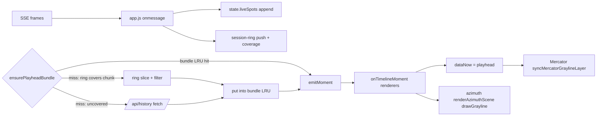

# Session Ring & Playhead Grayline - Plan

## Goal Capsule

- **Objective:** A 6-hour in-memory session ring of received live spots makes timeline rewind within session coverage zero-fetch, narrowing filter changes re-slice the ring, and the grayline terminator follows the timeline playhead.
- **Product authority:** The user (operator of horstreporter); scope decided in the 2026-09-11 ideation-to-brainstorm session for item 1 of the timeline Recommended Path (docs/ideation/2026-09-11-timeline-live-view-ideation.html).
- **Open blockers:** None. All scoping decisions were settled in dialogue or in the planning synthesis.

---

## Product Contract

*Product Contract preservation: changed R9 — parity re-scoped from "byte-identical" to render-equivalent (evidence: live SSE frames carry no absolute spot time, and the live wire strips sender/receiver for non-DX-cluster spots). All other requirements, decisions, and acceptance examples unchanged; stream-lifecycle semantics confirmed in synthesis are carried as KTDs under the Planning Contract.*

### Summary

The timeline client retains the live spots it already received in a bounded local ring, so replaying the session's own coverage costs zero `/api/history` fetches. Filter narrowing re-slices the ring instead of refetching. A shared `dataNow()` clock makes the grayline terminator track the playhead — smooth during playback, bucketed during drag-scrubbing. The live SSE connection stays open during timeline, soft-paused, so the ring keeps growing while replaying.

### Problem Frame

The timeline feature (static/timeline.js, history.go) fetches every chunk from `/api/history`, even windows the tab itself received minutes earlier. Each fetch pays the server's LRU, per-IP rate limit, and Postgres connection-per-miss — on a prod box with an OOM and PG-crash history. The client also throws its data away: entering timeline closes the SSE stream and clears `state.liveSpots` (static/app.js:2116-2133), and the chunk LRU is wiped on both enter and exit (static/timeline.js:412-419, 436-452) with a rationale comment that predates any ring. Meanwhile the grayline terminator is computed from `Date.now()` in both projections (static/map.js:394, static/azimuth-runtime.js:957-959) and is never synced from timeline moments, so a 24h replay shows past spots under today's daylight. HamRBN's shutdown is the standing lesson: raw dots-on-map replay alone wasn't sticky; responsive time-resolved navigation is the value. This item is the cheapest de-risking step of the whole timeline path (ideation survivor I7 + the dataNow() half of I3).

### Requirements

**Ring and coverage**

- R1. Received live frames are retained in a bounded in-memory ring storing its own raw copies (absolute receive time and payload), independent of the age-prune loop that mutates `state.liveSpots` in place.
- R2. The ring retains the last 6 hours of received data, with a spot-count cap as a backstop for hot bands (eviction pattern mirrors `MAX_LIVE_SPOTS` batch-oldest drop; the cap value is ring-specific, see KTD-6).
- R3. Timeline playback over ring-covered 1-hour windows resolves from the ring with zero `/api/history` requests; uncovered windows fall through to the archive path unchanged.
- R4. Narrowing filter changes (disable a band, raise an SNR threshold) re-slice the ring instead of wiping and refetching.

**Stream lifecycle**

- R5. Entering timeline mode keeps the SSE connection open; live frames continue to arrive and feed the ring while the timeline is active (rendering stays driven by timeline moments).
- R6. Exiting timeline mode resumes live rendering from the data received during replay — no full server history dump on exit.

**Playhead grayline**

- R7. A shared `dataNow()` clock (playhead time in timeline mode, wall clock otherwise) drives the grayline terminator in both projections.
- R8. During playback the terminator tracks the playhead; during drag-scrubbing it snaps in 5-minute buckets (the hybrid chosen in the visual probe).

**Filter parity**

- R9. Moments sliced from the ring are render-equivalent to moments sliced from an archive-fetched bundle for the same window and filter key: the same spot set within a small time tolerance, same ordering, same rendering inputs. (Amended during planning from "byte-identical" — live SSE frames carry no absolute spot time, and the live wire strips sender/receiver for non-DX-cluster spots; see KTD-5.)

### Key Decisions

- **Zero-fetch rewind as the primary value** (session-settled: user-directed — chosen over instant-filter-changes and archive-safety-net framings: rewind responsiveness is the core timeline interaction).
- **Ring as a chunk source, composition over replacement** (session-settled: user-directed — chosen over rewriting the playhead to slice the ring directly: smallest diff on timeline.js, same value; the ring simply becomes the zero-fetch case of the existing bundle lookup).
- **Keep SSE open during timeline** (session-settled: user-directed — chosen over closing as today and over close-but-keep-pre-enter-ring: gapless rewind near "now"; costs a held connection and reworks the teardown/restore path).
- **6-hour ring depth** (session-settled: user-directed — chosen over 1h and 24h: covers the timeline's 6h preset end to end at a few MB for typical QTH-filtered rates).
- **Hybrid grayline** (session-settled: user-directed, visual probe — smooth during playback, bucketed while scrubbing, chosen over always-bucketed and always-continuous).
- **Re-slicing is narrowing-only.** Live spots are server-filtered (`streamClientFilter.spotAllowed`, server.go:506-528), so spots excluded at receive time were never delivered; widening filters and qth changes cannot re-slice and fall through to `/api/history`.
- **Ring is session-only.** No persistence across reloads (no IndexedDB, no localStorage for spots); the archive remains the deep/foreign-URL path.

### Acceptance Examples

- AE1. Operator watches a band for 2 hours, opens timeline, rewinds to 90 minutes ago, plays to now.
  - **Covers:** R1, R3, R5, R9.
  - **Given:** SSE connected continuously; **When:** timeline covers the 6h preset inside session coverage; **Then:** zero `/api/history` requests fire and the moment matches what a fresh archive bundle would serve.
- AE2. With two bands enabled, the operator disables one mid-session and re-opens the timeline.
  - **Covers:** R4, R9.
  - **Then:** the ring is re-sliced for the narrower filter with no fetch; re-enabling the band (widening) fetches from `/api/history`.
- AE3. Timeline plays back a window from 5 hours ago in Mercator and azimuth projections.
  - **Covers:** R7, R8.
  - **Then:** the terminator sits at the window's data-time, moves smoothly during playback, and steps in 5-minute buckets while scrubbing.
- AE4. Hot band bursts past the spot-count cap mid-session.
  - **Covers:** R2.
  - **Then:** the ring evicts oldest-first without unbounded memory growth, and ring misses fall through to the archive silently.

### Scope Boundaries

- Widening filter changes and qth changes: still served by `/api/history` (server-side filtering makes client re-slice impossible there).
- Ring persistence across page reloads: none.
- Whole-24h density, coarse tier, honesty scrub bar: separate items (I6, I2 in the ideation doc).
- Server-side changes: none required; the heartbeat tick is I3a, a separate item.
- "Session-covered" shading on the scrub bar (I2 vocabulary): deferred — cheap to add later since the ring knows its coverage.
- QTH change mid-timeline: exits timeline, clears the ring, and accepts one full server re-stream (per-client qth filtering makes the ring's entire cohort foreign).
- Band-lab activity chart and WSPR matrix stay wall-clock anchored during replay (presentation inconsistency accepted for this plan; no cadence-guard change).
- No t1 creep: replaying near "now" does not extend the window; re-anchoring via the existing `setRange` remains the explicit user action.

### Success Criteria

- Rewinding within session coverage triggers zero `/api/history` requests (observable in network activity and the server's history rate limiter counters).
- A narrowing filter change causes no fetch and no LRU wipe.
- The terminator visibly tracks the playhead during playback in both projections.
- Memory stays bounded: ring depth 6h with the count backstop; measured on a hot-band session.

### Dependencies / Assumptions

- The uncommitted timeline feature (static/timeline.js, history.go) is the substrate; this item lands on the same branch.
- Assumption (revised during planning): the timeline render gate is a dedicated gate in app.js, not `state.softPaused` — that flag is owned by the tab-visibility machinery; the stream keeps running and only rendering is gated.
- Assumption: a typical QTH-filtered session receives a few thousand spots per hour (per the history.go sizing comment), so 6h ring memory is a few MB; the count cap bounds pathological rates.
- Pre-session coverage is bounded by the connect-time history dump (≤60 min): the 6h preset becomes zero-fetch only after ~5h of streaming. Expectation, not a defect.

### Outstanding Questions

All planning-time questions were resolved (see Planning Contract). Deferred to implementation:

- Grayline playback cadence numbers (Mercator rebuild Hz, azimuth recompute Hz) — spike and measure before freezing AE3 tuning; see KTD-8.
- Exact ring internal layout (per-chunk vs interval structures) beyond the contract in KTD-4.

### Sources / Research

- Grounding dossier: /tmp/compound-engineering-501/ce-brainstorm/session-ring/grounding.md (file:line quotes for all ten verified claims; all confirmed by a fresh-context verifier).
- Ideation deliverable: docs/ideation/2026-09-11-timeline-live-view-ideation.html (item 1 of Recommended Path, with the stress-test narrowing that shaped this scope).
- Code anchors: static/timeline.js (bundle LRU, toLiveSpot), static/app.js:2116-2133 (today's teardown), static/map.js:394, static/azimuth-runtime.js:957-972, server.go:506-528, history.go (parity contract).
- Planning research: repo pattern research (SSE lifecycle, timeline consult point, test conventions, server parity facts), operator-flow gap analysis (pause model, coverage contract, exit semantics), institutional-learnings sweep (one conventions doc; no prior ring/LRU/clock knowledge on record).

---

## Planning Contract

### Key Technical Decisions

Session-settled decisions (instantiate the Product Contract's labeled Key Decisions; inherit their annotations):

- **KTD-1. Zero-fetch rewind is the primary value** — inherits the Product Contract's session-settled decision; the ring is optimized for rewind responsiveness over any other benefit.
- **KTD-2. Ring as a chunk source, composition over replacement** — inherits the session-settled decision; the ring is consulted inside the existing bundle lookup, never behind the playhead.
- **KTD-3. SSE stays open during timeline** — inherits the session-settled decision; drives the teardown rework in U4.
- **KTD-4. 6h ring depth** — inherits the session-settled decision; the depth is a Tunables constant.
- **KTD-5. Parity is render-equivalent, not byte-identical** (confirmed in synthesis) — live SSE frames carry only server-stamped `ageSeconds` (server.go:233-244), so the ring derives absolute `t = receiveWallClock − ageSeconds` at push time and inherits client/server clock skew; the live wire also strips sender/receiver for non-dxcluster spots (server.go:467-485) where `/api/history` includes them (history.go:242-253). Parity is therefore tested as set-identity of rendered inputs with a ±2s tolerance on `t`; sender/receiver absence for mqtt/wspr spots matches live rendering (the fields are consumed only by the dxcluster popup).
- **KTD-6. Ring cap is 2-dimensional: 6h by derived receive time + a ring-specific count backstop of 50,000** (confirmed in synthesis) — the live-list cap `MAX_LIVE_SPOTS` (20000, static/app.js:23-26) would evict the 6h preset's tail on an active QTH; 50k mirrors the server's own history ceiling (`historyMaxSpotCount`, history.go:34). Eviction is oldest-received batch drop, mirroring `MAX_LIVE_SPOTS`.
- **KTD-7. Ring coverage contract: strict per-chunk contiguity.** A ring bundle may be synthesized for a chunk iff `ring.minT ≤ chunkT0` and there is no interior gap in `[chunkT0, min(chunkT1, lastReceivedT)]`; the future-side overhang of the chunk containing "now" is harmless because moment windows never extend beyond now. Coverage is tracked as receive-time intervals so SSE outages create real misses. A naive "ring non-empty ⇒ serve" check would render silent holes as dead bands — strictly worse than fetching. Misses fall through to `/api/history` silently (AE4).
- **KTD-8. Grayline cadence: hybrid per the settled decision, with a spike.** Scrub = strict 5-minute buckets on the playhead. Playback = playhead-bucketed key on both projections: at 600× a bucket crosses every ~0.5 wall-seconds (the visual probe's "invisible" case), and the azimuth 320ms wall-clock throttle bounds recompute below that. Implementation spikes and measures a Mercator data-URL rebuild and the azimuth pixel-loop recompute at real canvas sizes before freezing any finer playback cadence; slower speeds may show visible steps and are tuning, not scope.
- **KTD-9. `dataNow()` is narrow.** It is a small shared clock (setter/getter, home module to be chosen at implementation; candidate: an export from timeline.js or a tiny module) consumed **only** by the grayline time basis in static/map.js and static/azimuth-runtime.js. All cadence guards — render throttle, active-area rebuild intervals, the azimuth 320ms recompute throttle — stay on wall-clock `Date.now()`; keying them on data-time would freeze or storm during 600× replay (flow-analysis finding F9).
- **KTD-10. Pause model: dedicated timeline gate, not `state.softPaused`.** `state.softPaused` is owned by the visibility machinery (`syncSoftPauseWithVisibility`, static/app.js:689-729); reusing it would resume live rendering on every refocus mid-replay and clobber the timeline moment. Timeline gets its own gate: while it is active, `scheduleRender` is a no-op for live rendering regardless of caller, the SSE `onmessage` path keeps appending to `liveSpots` and the ring, and `syncSoftPauseWithVisibility` becomes timeline-aware (early-return during timeline). `resumeFromSoftPause` stays visibility-only.
- **KTD-11. Exit = rebuild from the ring tail.** On exit, `state.liveSpots` is rebuilt from the ring's last live-window (deduped, t-sorted) instead of `startLiveStream(false)` — no server dump (R6). This also bypasses the `resumeFromSoftPause` bulk-aging bug (static/app.js:707-716 adds the whole pause duration to every spot's stepped `ageSeconds`, which would prune everything received during a multi-hour replay). Filter changes made during timeline are reconciled with the stream filter on exit (widening queued during replay, reconciled via the existing `restartStreamIfSubscribed` semantics). A qth change mid-timeline invalidates the whole ring and exits to one full re-stream (accepted dump). Fatal SSE drop mid-timeline: one silent stream restart attempt (the ring absorbs the reconnect dump); if it fails again, surface ring staleness rather than serving stale-covered moments silently.
- **KTD-12. Timeline-blind control semantics during timeline.** Narrowing (band-disable or SNR-raise) is handled purely client-side: re-slice + re-emit the current moment, stream untouched. Widening / enabling an unseen band does not restart the stream mid-timeline; it is queued and reconciled on exit (KTD-11). A submit (stop) click exits timeline first, then performs its original live-stream action. Entry-failure fallback leaves the stream alone and surfaces the error (today's catch calls `startLiveStream(false)`, which would stack a second EventSource on the still-open one).
- **KTD-13. Ring key and filters mirror the bundle contract exactly.** The ring keys on the same fields as `bundleCacheKey` (static/timeline.js:141-146, 193-197): qth/surroundings-scoped, filter fields, and window — `selectedBand` is excluded because `/api/history` ignores it (server.go:436-449 applies it only to square_details) and band focus is client-side everywhere; the re-slice replica of `streamClientFilter.spotAllowed` applies SNR thresholds only to mqtt and rbn source types.
- **KTD-14. The ring lives in its own module (static/session-ring.js), not in state.js.** state.js is plain fields only (25 lines, no behavior); the repo pattern for behavior modules is a standalone ES module with an `__internals` export for vitest (static/timeline.js:654-665, static/afterglow.js:228-234). Fed from the SSE `onmessage` hook right after the `__recvMs`/`__recvAge` stamps (static/app.js:1973-1975); the connect-time and reconnect history dumps flow through the same path, so the ring is pre-seeded with up to ~60 min of pre-session coverage for free.
- **KTD-15. Band-lab activity chart and WSPR matrix stay wall-clock anchored during replay** (confirmed in synthesis) — presentation consistency is deferred, not silently inherited; they already throttle their fetches so no request storm arises.

### High-Level Technical Design

The ring never bypasses the moment pipeline: it only turns `/api/history` fetches into local slices at the existing bundle-lookup miss. Rendering, `toLiveSpot`, and `sliceMoment` are untouched.

Filter/submit/qth semantics during timeline (decision matrix):

| Event | Live mode (today, unchanged) | Timeline mode (this plan) |
|---|---|---|
| Band disable / SNR raise (narrowing) | stream reconnect | client re-slice + re-emit; stream untouched |
| Band enable / SNR lower (widening) | stream reconnect | stream untouched; queued, reconciled on exit |
| QTH change | full re-stream | exits timeline, clears ring, one full re-stream |
| Submit (stop) click | stops stream | exits timeline, then performs the original action |
| Tab hidden / refocus | soft-pause (unchanged) | visibility handler early-returns; rendering stays on the moment |
| Fatal SSE drop | submit returns to 'go' | one silent restart attempt; on failure, surface ring staleness |

### Sequencing

U1 → U2 → (U3, U4 in either order, both depend on U1-U2) → U5 → U6 → U7. U4 is the riskiest diff and carries a characterization-first execution note.

---

## Implementation Units

### U1. Session-ring module

- **Goal:** A bounded in-memory ring of raw spot copies with coverage tracking and filter re-slicing.
- **Requirements:** R1, R2, R4, R9 (data substrate); AE4.
- **Dependencies:** none.
- **Files:** `static/session-ring.js` (new), `static/session-ring.test.js` (new).
- **Approach:** Module layout mirrors `static/timeline.js` (header comment, Tunables, pure helpers, controller object, Public API, `__internals`). Each push stores an immutable raw copy with an absolute derived time `t = receiveWallClock − ageSeconds` (inputs already stamped as `spot.__recvMs`/`spot.__recvAge` at static/app.js:1973-1974, chosen exactly because they stay stable while the prune mutates `ageSeconds`). Dedup on (band, sender, receiver, sourceType, derived t); receive-time ordering maintained. Two-dimensional eviction on push: spots older than 6h evicted, batch-oldest drop when the count passes the KTD-6 cap. Coverage tracked as contiguous receive intervals so SSE outages create real gaps. Public surface: push, coverage check for an exact window, slice to a t-sorted array, filter re-slice (client-side replica of `streamClientFilter.spotAllowed`: enabled-band set plus SNR thresholds applied only to mqtt and rbn source types, dxcluster/wspr exempt — per KTD-13 selectedBand is not applied), clear.
- **Patterns to follow:** `MAX_LIVE_SPOTS` batch-oldest drop (static/app.js:23-26, 1963-1967); `BUNDLE_CACHE_MAX` LRU (static/timeline.js:40-45); `__internals` export for vitest.
- **Test scenarios:**
  - Push keeps a raw copy: mutate the live list after push (age-step `ageSeconds += 5`, prune) → ring values unchanged, derived t stable.
  - Eviction: spot older than 6h evicted on push; count-cap overflow drops oldest batch; AE4 shape.
  - Coverage: contiguous receive stream reports full coverage; an injected gap (simulated SSE drop) makes a chunk spanning the gap a miss; chunk bottom below ring.minT is a miss; chunk overhang past lastReceived is still covered (future-side gap harmless).
  - Dedup: same spot re-delivered (reconnect dump re-seeding) → single entry.
  - Re-slice: narrowing re-slice excludes the disabled band / below-threshold spots without data loss (filter applied at slice time, so widening later restores previously excluded spots from the ring); dxcluster and wspr spots are never SNR-filtered.
  - `clear()` empties spots and coverage.

### U2. Ring feed and invalidation wiring

- **Goal:** Every received live frame feeds the ring; a qth change invalidates the whole ring.
- **Requirements:** R1, R2.
- **Dependencies:** U1.
- **Files:** `static/app.js` (push hook in the SSE `onmessage` handler after the `__recvMs`/`__recvAge` stamps; qth-change hook).
- **Approach:** One push call at static/app.js:1973-1975. Because connect-time and reconnect history dumps flow through the same `onmessage`, the ring is seeded with up to ~60 min of pre-session coverage automatically (KTD-14). QTH change clears the ring entirely (the server filters per-client by qth, so the cohort is foreign).
- **Test scenarios:**
  - A mocked SSE frame lands in the ring with derived t from the stamped inputs.
  - Connect-dump frames seed pre-session coverage (ring holds frames received before the user opened anything).
  - QTH set clears the ring and its coverage.
  - Frames still feed the ring while timeline is active (feed independent of the render gate).

### U3. Ring as zero-fetch chunk source in timeline.js

- **Goal:** Timeline playback over ring-covered 1-hour windows resolves locally; uncovered windows fall through unchanged.
- **Requirements:** R3, R4, R9; AE1, AE2.
- **Dependencies:** U1, U2.
- **Files:** `static/timeline.js` (consult at the bundle-cache miss in `ensurePlayheadBundle`, static/timeline.js:310-329), `static/timeline.test.js`.
- **Approach:** On the `getBundle(key)` miss, ask the ring for the chunk's exact `[t0,t1]` from `chunkBoundsFor` — the ring must handle the non-hour-aligned clamped edges (first/last chunk of a range) and the future-side overhang of the chunk containing "now". On a covered hit, synthesize a bundle-shaped object (key, t0, t1, spots sorted by t ascending — same shape `fetchBundle` constructs) and put it into the existing bundle LRU so `sliceMoment` and `toLiveSpot` work unmodified. Uncovered → existing fetch path unchanged. Filter changes re-slice at synthesis time via the ring's filter replica; the bundle LRU's enter/exit wipes stay (their stale-qth rationale is correct and the ring lives outside the controller).
- **Execution note:** Implement the ring-consult test-first against the existing bundle contract shape.
- **Test scenarios:**
  - In-coverage seek synthesizes a bundle with zero fetch calls; its emitted moment matches the fetched bundle's moment for the same fixture (set-identity, ±2s t).
  - Uncovered chunk (before ring.minT, or spanning an interior gap) falls through to `/api/history`.
  - Narrowing filter change re-slices with no fetch; widening falls through to fetch (AE2).
  - Chunk containing "now" serves its covered portion; `sliceMoment` windows never extend beyond lastReceived.
  - Enter/exit LRU wipes still occur; the ring survives across them (only bundles are wiped).

### U4. Timeline stream lifecycle rework in app.js

- **Goal:** Entering timeline keeps the SSE open with rendering gated; exit resumes live rendering from the ring tail without a server dump; control handlers become timeline-aware.
- **Requirements:** R5, R6; AE1.
- **Dependencies:** U1, U2 (U3 not required).
- **Files:** `static/app.js` (`startTimelineMode`, `stopTimelineMode`, `scheduleRender`, `syncSoftPauseWithVisibility`, the submit handler, the band/SNR handlers around `restartStreamIfSubscribed`), app-level tests under `test/` (the existing harness mocks leaf modules and re-imports app fresh per test).
- **Approach:** Dedicated timeline gate per KTD-10/KTD-11/KTD-12. `scheduleRender` no-ops (or re-emits the last timeline moment) while timeline is active, regardless of caller. `onmessage` keeps appending to `liveSpots` and the ring. `syncSoftPauseWithVisibility` early-returns during timeline. Enter: no SSE teardown, no `liveSpots` clear; entry-failure fallback leaves the stream alone and surfaces the error. Exit: rebuild `state.liveSpots` from the ring's last live window (deduped, t-sorted) instead of `startLiveStream(false)`; reconcile any queued widening via the existing `restartStreamIfSubscribed` semantics. QTH change mid-timeline: exit, clear ring, one full re-stream. Submit click mid-timeline: exit timeline first, then perform the original action. Transport button state changes use the `data-mode` + pure-helper pattern from docs/solutions/conventions/keep-button-state-out-of-layout-and-text.md (no text-based state reads).
- **Execution note:** Riskiest diff in the plan — add characterization coverage of today's enter/exit behavior before modifying the teardown path, and write the timeline-gate app tests before touching it.
- **Test scenarios:**
  - Entering timeline does not close the SSE, does not clear `liveSpots`, and subsequent frames still land in the ring.
  - `scheduleRender` during timeline does not paint the live array over the moment (theme toggle, band pill, and auto-band-switch callers included).
  - `visibilitychange`/`pageshow`/`focus` during timeline does not resume live rendering; soft-pause behavior when timeline is inactive is unchanged.
  - Exit after a 2h replay rebuilds `liveSpots` from the ring tail with no `/api/stream` reconnect request, and spots received during replay are present.
  - Exit after a long replay does not bulk-age ring-derived spots (no empty-map over-aging).
  - Narrowing change mid-timeline: no stream restart, current moment re-emitted narrower; widening mid-timeline: stream untouched, reconciled on exit.
  - QTH change mid-timeline: timeline exits, ring cleared, one fresh stream starts (one dump accepted).
  - Submit click mid-timeline: exits timeline, then performs the original stream action.
  - Entry failure (uncovered-chunk fetch 503): stream left alone, error surfaced, no duplicate EventSource.
  - Fatal SSE drop mid-timeline: one silent restart attempt; on second failure the stale-coverage state is surfaced.

### U5. Shared dataNow() clock and Mercator playhead grayline

- **Goal:** The grayline terminator time comes from a shared `dataNow()`; Mercator syncs on timeline moments and gains a live-mode refresh cadence.
- **Requirements:** R7, R8 (Mercator leg); AE3.
- **Dependencies:** U4.
- **Files:** shared clock (small module or an export from `static/timeline.js` — exact home at implementation), `static/map.js` (`syncMercatorGraylineLayer` keys its bucket and overlay cache on the clock, via the options object it already accepts), `static/app.js` (sync call in the `onTimelineMoment` listener; a live-mode periodic refresh so the terminator advances without theme/projection toggles — today it only refreshes on those three events, static/app.js:881-885, 1293, 1431).
- **Approach:** Per KTD-9, only the grayline time basis reads the clock. Mercator keeps its 5-minute bucket machinery; the bucket and cache key derive from the clock's value (playhead during timeline, wall clock otherwise), and the sync fires moment-driven from `onTimelineMoment` with a force-on-bucket-crossing rule. Scrub = strict buckets; playback = the KTD-8 cadence. The added live-mode refresh runs on wall-clock cadence.
- **Test scenarios:**
  - The clock returns playhead time in timeline mode and wall clock in live mode.
  - Mercator bucket and overlay cache keys derive from the clock value.
  - A timeline moment crossing a 5-minute playhead bucket forces a sync; within-bucket moments do not rebuild the overlay.
  - Live mode: the refresh cadence advances the bucket over wall time.
  - Cadence guards elsewhere (render throttle, rebuild intervals) remain keyed on `Date.now()`.

### U6. Azimuth playhead grayline

- **Goal:** The azimuth terminator keys on the clock's value with the hybrid cadence.
- **Requirements:** R7, R8 (azimuth leg); AE3.
- **Dependencies:** U5.
- **Files:** `static/azimuth-runtime.js` (`drawGrayline` cache key and options threading through `renderAzimuthScene`), azimuth tests under `test/`.
- **Approach:** `renderAzimuthScene` options carry the playhead time; the `drawGrayline` cache key folds in the playhead bucket (replacing the `Date.now()` bucket, static/azimuth-runtime.js:959-966). Scrub = strict 5-minute buckets. Playback = playhead-bucket key with the existing wall-clock 320ms throttle retained as the recompute bound (at 600× a bucket crossing lands every ~0.5 wall-seconds, above the throttle, so recompute ≈ one per crossing). The throttle itself never reads the clock (KTD-9); per-frame recompute stays out of scope.
- **Test scenarios:**
  - Scrub produces bucketed keys (snap), not per-event recomputes.
  - Playback at 600× yields recompute cadence bounded near ~2 Hz, no per-frame storm.
  - Replaying the same window with the same playhead bucket reuses the cache (key determinism).
  - The 320ms throttle remains wall-clock keyed.

### U7. Parity proof and end-to-end harness extension

- **Goal:** Prove ring-sliced moments are render-equivalent to archive bundles; prove zero-fetch rewind end-to-end.
- **Requirements:** R9; AE1, AE2 verification.
- **Dependencies:** U3, U4.
- **Files:** `static/session-ring.test.js` or a colocated parity test (static/ vitest), `scripts/tl-check.mjs` (extend).
- **Approach:** Parity fixture replays the same window through a ring-synthesized bundle and a recorded `/api/history` bundle (historySpot field shape per history.go:68-79, 242-253) and compares `toLiveSpot` output as set-identity with a ±2s tolerance on `t` (KTD-5). The Go side already proves the server leg (`TestHistoryHandlerFallbackFiltersLikeStream`, history_test.go:99); no server changes. Extend `scripts/tl-check.mjs` with a step that rewinds inside session coverage and asserts zero new history fetches (the harness already counts fetches by URL); keep the deep-uncovered-scrub `chunkFetches > 1` assertion.
- **Test scenarios:**
  - Parity fixture passes (render-equivalent set, ordering preserved, ±2s t).
  - tl-check in-coverage step observes zero history fetches (AE1).
  - tl-check deep-uncovered step still fetches (>1) — the archive path is intact.

---

## Verification Contract

| Gate | Command / method | Applies to |
|---|---|---|
| Frontend unit tests | `npm test` (vitest, jsdom) | U1-U7 |
| Typecheck + tests | `npm run check` | all |
| Backend untouched | `go test ./...` stays green; no server-side changes in this plan | all |
| Zero-fetch E2E | `node scripts/tl-check.mjs` with the extended in-coverage step | U3, U7 |
| Grayline cadence | Manual profile at 600× playback in both projections (the mercator perf gate mocks the map and cannot catch redraw jank) | U5, U6 |
| Ring memory | Hot-band session measurement against the KTD-6 cap | U1, U2 |

---

## Definition of Done

- All units U1-U7 complete with their test scenarios passing; `npm run check` and `go test ./...` green.
- Success Criteria verified: zero-fetch rewind in coverage (network-observable), no-fetch narrowing re-slice, terminator tracking the playhead in both projections, bounded ring memory on a hot-band session.
- Abandoned-attempt code removed: no dead-end experimental code left in the diff.
- Deferred items (grayline playback cadence tuning numbers, session-coverage shading on the scrub bar) documented in Outstanding Questions / Scope Boundaries, not silently dropped.