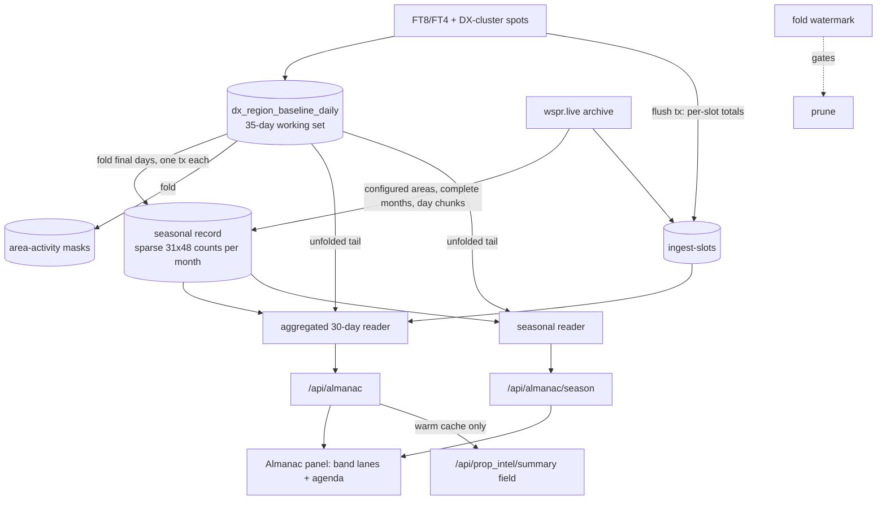
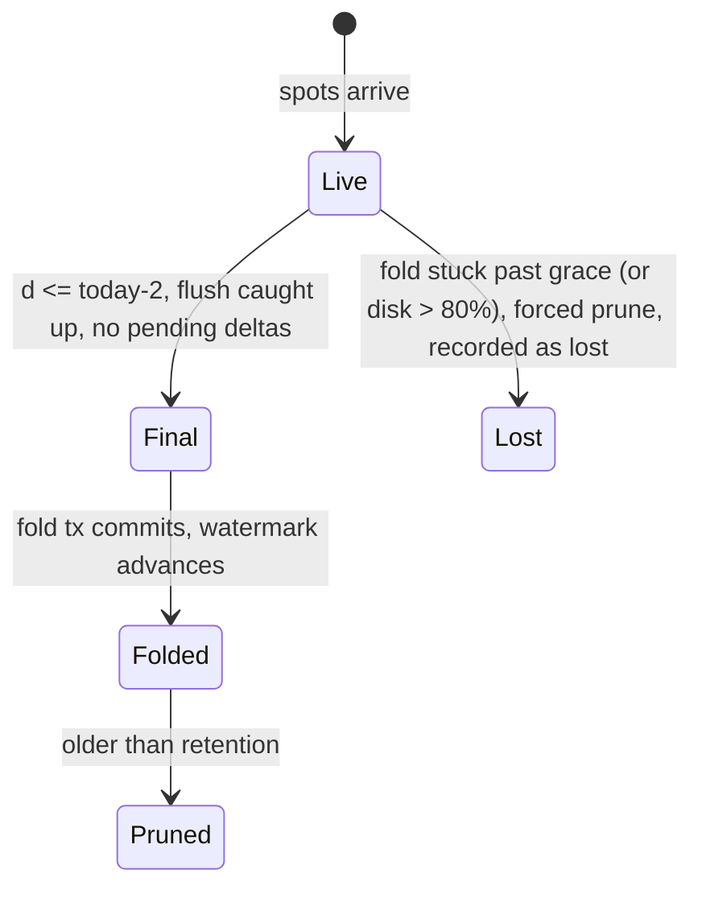

# QTH Propagation Almanac - Plan

## Goal Capsule

- **Objective:** Show an operator which regions are usually reachable from their own QTH, on which band and at what time of day, and how that shifts through the seasons.
- **Authority order:**
  1. Product Contract (below).
  2. Planning Contract KTDs.
  3. Unit bodies.
  4. The benchmark `docs/reference/typical-hf-openings-jo62.md` as acceptance evidence. The operator's area is JO32; the doc carries a JO32 applicability note.
- **Stop conditions:** Stop and ask if any of these happen:
  - An EXPLAIN on a prod-sized table shows the per-QTH read cannot stay under the 1.5 s timeout.
  - The seasonal-record size estimate exceeds 2 GB/year.
  - wspr.live rejects or throttles the backfill pattern.
- **Execution profile:** U3 (the seasonal record and fold) comes first and deploys early. The rest of the Go backend (U1, U2, U4–U6) follows, then the frontend (U7–U8), then the acceptance script (U9). Each unit lands as its own commit on a feature branch.
- **Tail ownership:** Deploy follows the repo's `./deploy.sh` flow. The horstapp widget rendering is follow-up work in `../horstapp`.
- **Open blockers:** None.

---

## Product Contract

### Summary

A new Almanac panel shows, for the operator's QTH, which bands usually carry each region at each UTC hour, expressed as "opened N of 30 days". A month × hour drill-down shows how each opening drifts through the seasons. An agenda on top lists the openings that usually come next, and the horstapp widget gets a one-line version of it. Behind the panel sit three pieces: a per-QTH reader of the data already collected, a permanent seasonal record that folds in each day before the 35-day prune removes it, and a WSPR archive backfill so seasons are visible from the first day.

### Problem Frame

HorstReporter already writes a per-QTH record of which region was heard in which half-hour. Every spot lands in the daily region baseline under the observer's grid square. Nothing reads it per QTH. Every existing reader sums all observers into one global view, counts only days that had activity, and measures spot volume rather than how often a path was open. That volume is dominated by where reporters live (EU/NA).

The history is also short-lived. Daily rows are deleted after 35 days, and PSKReporter history cannot be re-fetched, so every pruned day is lost for good. That makes the question the operator actually asks unanswerable today: which regions are usually open from here at what time, and how does that change with the season. The same gap blocks planning a contest or DX target. External tools either model propagation (VOACAP, monthly medians) or show the live picture. None gives an empirical "usually open from my grid, by hour".

### Key Decisions

- **Ideas in scope: per-QTH statistic, seasonal record, openings agenda.** (session-settled: user-directed — chosen over a typical-hour layer on the live matrix, a per-QTH baseline for the "unusual" glyph, a solar-time axis and bearing sectors: those were ranked in ideation and left for later.)
- **The primary purpose is understanding the patterns, then contest/DX planning, then tonight's go/no-go.** Deciding which band to use while already on the air is not a design driver. (session-settled: user-directed — chosen over "band choice on air" as a primary use.)
- **A typical-day view is in the first version alongside the agenda.** (session-settled: user-directed — chosen over "agenda only" and "view first, agenda later": an agenda alone cannot show the shape of the day.)
- **Landing view: one row per region, with a lane per band.** Each lane shows when that band usually carries the region. The month × hour view of a single region and band is the drill-down. (session-settled: user-directed — chosen over a region × hour heatmap per band and a 24 h clock per band after comparing rough sketches.)
- **The Almanac is its own panel.** (session-settled: user-directed — chosen over a mode inside the Propagation panel and a section inside Band Stats: more room and less crowding.)
- **"Usually open" means a fixed spot floor, with an explicit "not enough data" state.** A slot counts as open on a day when it reaches at least k spots between the operator's area and the region. A cell whose area had too few active days on that band shows as unknown, never as closed. (session-settled: user-approved — chosen over a fixed floor with no unknown state and over a floor relative to each region's activity. The unknown state is honest about sparse regions at little cost, and a relative floor adds complexity the acceptance tests do not need.)
- **Seasonal history from the first day comes from a WSPR archive backfill, labelled as its own layer.** (session-settled: user-directed — chosen over growing the record forward only and over deferring the seasonal drill-down.)
- **The widget line comes from an additive extension of the existing summary payload.** (session-settled: user-directed — chosen over a new endpoint. The payload's "frozen" status is relaxed for additive fields only.)
- **Validation is against a researched JO62 benchmark.** The research is not general, and benchmarks for other QTHs are deferred. (session-settled: user-directed — the user asked for web research across several sources to serve as the check.)
- **The user-facing statistic is labelled "opened N of 30 days" (or "N of M days"), not "P(open)".** "P(open)" already names the live nowcast in `docs/plans/2026-08-11-001-feat-propagation-intelligence-layer-plan.md`.

### Actors

- A1. **Operator:** a station with a QTH set in the web app or in horstapp, looking for typical patterns and planning windows.
- A2. **HorstReporter backend:** keeps the daily region data, folds it into the seasonal record, and serves the Almanac and the widget line.
- A3. **wspr.live archive:** an external source of historical WSPR spots for the backfill.

### Requirements

**Per-QTH statistic**

- R1. The Almanac reports, for each band, region and 30-minute UTC slot, how many of the last 30 days the operator's area had that slot open, plus how many days were observed.
- R2. Days with no qualifying spots count as closed days, as long as the operator's area was active on that band that day. They are never skipped.
- R3. A cell whose area had fewer active days than a minimum on that band shows as "not enough data", distinct from "closed".
- R4. The operator's area starts at their grid square. When that square alone has too few active days, it widens outward to neighbouring squares, and the Almanac shows the radius it used.
- R5. A QTH given as a callsign uses the existing locator lookup. When the lookup fell back to the DXCC country centre, the Almanac says the location is approximate.
- R6. The statistic uses the data sources already feeding the daily region baseline: PSKReporter FT8/FT4, and DX-cluster spots that carry locators. WSPR appears only as the separate backfill layer (R10).

**Seasonal record**

- R7. Before a day's region data is pruned, it is folded into a permanent per-area record that keeps month, slot, band and region, with enough counts to recompute "N of M days".
- R8. The seasonal record is never pruned by the daily retention setting, and its size stays small enough for the production host's disk budget.
- R9. The month × hour drill-down shows, for one region and band, the typical opening per month across all months that have data.
- R10. A backfill imports historical WSPR spots from the wspr.live archive for the operator's area into the seasonal record as a separate WSPR layer. The drill-down labels which layer each month comes from.
- R11. The backfill is rate-limited and resumable, and can run again without double-counting.

**Presentation**

- R12. The Almanac panel's landing view shows one row per region, with a lane per band marking the hours at which that band usually carries the region. Intensity follows "N of M days", and a line marks the current time.
- R13. Selecting a region and band opens the month × hour drill-down (R9).
- R14. An agenda above the landing view lists the openings that usually start or continue in the next few hours as windows, for example "20 m to NA: usually 13:00–18:00 UTC (24/30 days)". It also shows whether each opening is already happening today.
- R15. Times are UTC. Local time may be shown as a secondary label.
- R16. The panel follows project UI rules: canonical band palette, no emojis, and always from the operator's QTH (no global view).

**Widget**

- R17. The widget summary payload gains an additive, optional field carrying a one-line "usually open now / next" text for the requesting QTH. Existing widget fields and their behaviour are unchanged.

### Acceptance Examples

- AE1. **Given** a JO32 operator in October 2026, **when** they open the Almanac, **then** 20 m to NA reads usually open 13–18z on at least 80% of days (the benchmark's acceptance test 1, judged against all of NA). **Covers R1, R12.**
- AE2. **Given** KH6 with very few spots from JO32 on 10 m, **when** the operator views that lane, **then** it shows as "not enough data" or rarely open, and never as a confident "closed". **Covers R3.**
- AE3. **Given** a rural grid square with little activity, **when** the Almanac loads, **then** it widens to neighbouring squares and shows the radius it used. **Covers R4.**
- AE4. **Given** a QTH entered as a callsign that only resolves to a DXCC centre, **when** the Almanac loads, **then** it shows that the location is approximate. **Covers R5.**
- AE5. **Given** the feature has run for two weeks, **when** the operator opens the December drill-down for 20 m VK, **then** months before collection started show WSPR-layer data, labelled as WSPR. **Covers R9, R10.**
- AE6. **Given** it is 12:30 UTC and 20 m to NA usually opens at 13:00, **when** the operator views the agenda, **then** the opening is listed as upcoming, and once live spots show it open today it is marked as already open. **Covers R14.**

### Success Criteria

- From JO32, the Almanac reproduces the acceptance tests in `docs/reference/typical-hf-openings-jo62.md`, section 3, with these adaptations:
  - NA-East tests are judged against all of NA.
  - Test 8 (NA-West only) is dropped.
  - The 10 m tests are judged against the daily SFI.
  - Test 13 (AN) is excluded from pass/fail.
- The operator can answer "when does band X usually reach region Y from here" from the landing view without reading a table.
- Seasonal history keeps growing across the retention window without disk-pressure incidents on production.

### Scope Boundaries

**Deferred for later**

- A typical-at-hour layer on the live Propagation matrix.
- A per-QTH baseline for the prop_intel "unusual" glyph.
- A solar-time (sunrise/sunset-relative) axis.
- Bearing × distance sectors in place of the continent boxes.
- Validation benchmarks for QTHs other than JO62.
- Splitting "where you are heard" from "what you hear".
- Space-weather-conditioned or analog-day forecasts.

**Deferred to Follow-Up Work**

- Rendering the new summary field in the horstapp widget, including its Swift and Kotlin mirrors (sibling repo `../horstapp`).
- Switching the DXLens region calendar to the per-QTH reader.
- Capturing the "fold before prune" and "negative cache on slow PG reads" patterns in `docs/solutions/`.

**Outside this feature**

- Per-spot or per-path link scoring. That stays in horstprop.
- RBN and CW-only openings in the statistic. RBN stays out of the baseline tables.
- Minute-level timing claims such as "opened 25 minutes early". Resolution is 30-minute slots.

### Dependencies / Assumptions

- The widget itself lives in the sibling `../horstapp` repository. Rendering the new line there is follow-up work in that repo. This plan only guarantees the payload field.
- wspr.live's fair-use terms allow a one-off, rate-limited historical backfill per area. This is unverified.
- The research benchmark reflects SFI of about 100–120 in autumn 2026. High-band results move with SFI.
- FT8 detects openings well below the prediction models' thresholds, so empirical windows are expected to run somewhat longer than the benchmark's model-based windows.

### Outstanding Questions

None block implementation. Planning resolved the earlier ones:
- Area unit, radius, backfill scope and storage shape are covered in KTD3–KTD8.
- DXLens was not switched; it is deferred to follow-up work.

Two items are deferred to implementation:
- **Exact values of k, the minimum active days and the WSPR k.** Tune them against the JO32 benchmark using live data (U9). They can be retuned later, because the seasonal record keeps per-day counts (KTD5). The defaults in KTD4 are starting points.
- **Measured seasonal-record size on prod.** U3 must measure it before enabling the fold. KTD5 sets the guard.

### Sources / Research

- `docs/reference/typical-hf-openings-jo62.md`: researched typical openings from JO62 and the acceptance tests.
- `docs/ideation/2026-09-28-daily-propagation-by-region-ideation.html`: ranked ideas; this plan combines ideas 1, 2 and 4.
- `dx_postgres.go:483-491`: key of the daily region baseline table. `dx_postgres.go:843-881`: two keys written per spot.
- `dx_postgres.go:2408-2429`: the region calendar reader has no grid filter and counts active days only.
- `dx_postgres.go:2050-2093`, `main.go:282`, `main.go:735-755`: 35-day batched prune across three region tables, with no rollup.
- `dxcluster.go:366-367`: DX-cluster spots with locators feed the same baseline. `rbn.go`: RBN is excluded.
- `wspr.go:16`, `wspr.go:127`, `wspr.go:159`: the existing wspr.live ClickHouse client, which reads both locators.
- `docs/api.md:238-247`: the summary endpoint is documented as frozen for horstapp widgets and cached for 60 s.
- `dx_conditions.go:143-148`, `spot.go:297`: callsign-to-locator lookup via QRZ, with a DXCC-centre fallback.

**Product Contract preservation:** changed AE1, the Goal Capsule and the Success Criteria to use the operator's area JO32 instead of JO62, and to judge NA as one region. Both are user clarifications made during planning. Every R-ID is unchanged.

---

## Planning Contract

### Key Technical Decisions

- **KTD1. NA stays one region; no taxonomy change.** The daily table stores only the far-end region code, so splitting NA couldn't apply to past data anyway. (session-settled: user-directed — chosen over splitting NA for the Almanac only or everywhere: keep the shared 11-region taxonomy. Benchmark NA-East tests are judged against all of NA, and the NA-West-only test is dropped.)
- **KTD2. The 30-day statistic is computed in SQL, over folded days plus the unfolded tail.**
  - One aggregated query per request sums `spot_count` per (band, region, slot, day) across the ring set, then `bit_or`s the days that reach k. Output is at most 4,752 rows, each carrying a 32-bit open-day mask.
  - The query reads days at or below the fold watermark from the seasonal record, and only later days (today, maybe yesterday) from the daily table.
  - It reads only the PSKR/cluster layer, for counts, activity and ingest totals alike (R6). The WSPR layer is used only by the seasonal drill-down (KTD7/U4).
  - M counts per slot. The area is "active" on day d in slot s when the ring has at least one spot on that band, to any region including its own, in s or the next slot. This is derived from the stored per-slot counts, so a silent night reads "unknown", not "closed".
  - A second small result returns per-(grid, band) active-day masks. They are used only for U1's widening decision. Nothing returns raw rows.
  - Response volume and Go memory are fixed no matter how busy the ring is.
- **KTD3. The area is resolved once per request, the radius is chosen per panel, and widening is capped.**
  - A new resolver returns `(grid4, source)`, where source is locator, qrz or dxcc. It wraps the logic in `deriveOperatorCluster` and caches its results, so the request path never calls QRZ.
  - Widening tries rings 0, 1 and 2 (via `getSquaresWithinRings`, `spot.go:185`) and stops at 2.
  - It picks the smallest radius at which more than half of the in-scope bands (160–10 m, excluding 6 m) meet M_min. The threshold is a named constant in the KTD4 block. The panel header shows that single radius.
  - Lanes still under M_min at that radius show as "not enough data".
- **KTD4. Starting defaults, tuned in U9.** All of these live in one Go constants block:
  - k = 2 spots per slot per day for the PSKR/cluster layer, and k = 1 for WSPR.
  - M_min = 10 of 30 days for the 30-day view, and M_min = 8 days per month for the seasonal view.
  - The agenda counts a slot as "usually" open when N/M ≥ 50%. It looks 12 h ahead, bridges a 1-slot gap, and lets windows cross midnight.
  - A slot is "alive" when its ingest total is at least 10% of that slot's 30-day median.
- **KTD5. The seasonal record is sparse-encoded: one row per (grid4, band, region, year_month, layer).**
  - `counts` holds the non-zero cells of the 31 days × 48 slots month grid (one uint8 per cell, capped at 255, day-major: `pos = (dom-1)*48 + slot`, 0..1487). Encoding (`almanac_sparse.go`, the single source of truth): a version byte `0x01`, then per non-zero cell in ascending `pos` order `uvarint(gap)` followed by one count byte (1..255), with `gap = pos - prevPos - 1` and `prevPos` starting at −1. Zero counts are never stored. Readers reject malformed rows (bad version, `pos` ≥ 1488, truncated varint, zero count), treat them as absent and log once.
  - The encoding is the compression. Postgres only compresses a tuple once it exceeds the compile-time TOAST threshold (~2 KB); `toast_tuple_target` does not lower that gate. A dense 1488-byte value therefore stayed uncompressed: prod measured 1492 B/row, about 8.7 GB/year. The table uses `fillfactor=70` and no TOAST or compression settings.
  - Measured on prod (2026-09): 249.6k key-months per month, with avg 94.8 non-zero cells per row (p50 8, p90 315, max 1343 of 1488). At about 2 B per cell (1 varint byte while gaps are below 128, plus the count), a row averages about 191–202 B. That gives about 1.5–1.6 GB/year including tuple overhead, fillfactor and the primary key. A one-row-per-slot design would have been 2.4–10 GB.
  - The fold can't patch the encoding in SQL. Inside the day's transaction it COPYs the day's keys into a temp table, streams the existing rows of those keys through a cursor, replaces the day's 48-slot segment in Go (SET semantics, so a re-fold is byte-identical), and upserts the re-encoded rows with `SET counts = EXCLUDED.counts`.
  - Per-day counts are kept so neighbouring grids can be summed per day before thresholding, and so k can be retuned later.
  - An **area-activity** table holds a 31-bit day mask per (grid4, band, year_month, layer).
  - An **ingest-slots** table holds a spot total per (day_index, slot, layer), in the same unit as the region-key counts (sum of `spot_count`). It is maintained incrementally inside the existing baseline flush transaction (about 17k rows/year), so no request-time query scans the daily table to decide whether ingest was alive.
    - When the fold streams a day that has no ingest-slot rows, such as the pre-deploy backlog, it seeds them from that day's per-slot sums in the same transaction.
  - All three tables are LOGGED, with a comment saying never to make them UNLOGGED.
  - Each fold rewrites every affected row, so heap churn is expected. The seasonal table gets aggressive heap autovacuum settings in the optional maintenance statements.
  - New indexes go only on these new tables. Nothing is added to `dx_region_baseline_daily` from `initSchema`. If the tail query needs an index there, it ships as a `scripts/migrate_*.sql` CONCURRENTLY script.
- **KTD6. The fold only touches final days, and it gates the prune.**
  - **When a day is final.** Day d is folded only when all of these hold:
    - d ≤ today(UTC) − 2;
    - the last successful baseline flush happened after the end of d plus 1 h;
    - no pending region delta is for a day ≤ d.
  - **Late spots.** In live `observe()` only, region-baseline keys from spots with timestamps outside [now − 24 h, now + 10 min] are dropped and counted. This matches the today−2 finality rule, so no spot can land on an already folded day. The clamp is not placed in the shared key emitter, so rebuilding the baseline from raw spots still works. Other baselines are unaffected.
  - **The fold transaction.** Go streams day d via the day_index index, builds per-(grid, band, region) 48-byte segments, and COPYs them into a temp table. One `INSERT … ON CONFLICT DO UPDATE` then overlays the segment at day-of-month − 1. The same transaction ORs the activity masks and advances the `dx_meta` watermark. SET semantics make re-folds idempotent. Timeout is 60 s.
  - **Prune gating.** The prune deletes only `day_index < min(cutoff, watermark + 1)`.
    - A 7-day grace period applies. It is skipped when the database disk is above 80% full.
    - Disk usage comes from a filesystem stat on the path given by `-almanac-disk-path` (on prod, the Postgres data directory). If the probe errors, the disk counts as over the threshold.
    - Past the grace period, a forced prune first advances the watermark past the forced range, records those days as `almanac_lost_days`, and logs at ERROR. Lost days read as "unknown", never "closed".
    - With the fold disabled, the gate is off entirely.
    - The fold runs on its own ticker, independent of `-dx-region-baseline-retention-days`.
  - **First deploy.** The watermark starts at `min(day_index)`, so folding begins at the next day. The oldest day may be partly pruned, so it is recorded in `almanac_lost_days`.
  - **Health.** `/api/stats` reports the fold watermark, fail streak, late-drop count and number of lost days.
- **KTD7. Seasonal drill-down semantics.**
  - Months are kept per year. Each calendar month shows the most recent year that has enough days, labelled with the year and layer.
  - PSKR/cluster data wins over WSPR once it has at least M_min days.
  - The watermark read and both data reads (seasonal ≤ W, daily > W) run in one read-only REPEATABLE READ transaction, so no day is counted twice or missed while a fold commits.
- **KTD8. The WSPR backfill covers configured, complete months only.**
  - Areas come from the flag `-almanac-wspr-backfill-areas` (JO32 on prod), and depth from `-almanac-wspr-backfill-years` (default 3). Only months that ended before the current month are backfilled.
  - The backfill ring for each configured area is the full widening maximum: rings 0–2 via `getSquaresWithinRings`. Any radius KTD3 picks is therefore covered.
  - Queries go one UTC day at a time, two per day: the ring aggregate and a global per-(day, slot) count for the WSPR ingest-alive totals. Each is bounded by time range and band whitelist and aggregated on the server.
    - The far end is grouped by grid4, not by field, and mapped to regions in Go.
    - Like the daily table, it emits both (rx4, tx-region) and (tx4, rx-region), so rows don't depend on which area ran.
    - On a ClickHouse timeout (code 159) or an oversized response, the day is split into hourly windows instead of being retried unchanged.
    - The backfill uses its own HTTP client, with a longer timeout, streaming JSON decode and no 4 MB cap.
  - A month's days are accumulated in Go. The month then commits in one transaction: DELETE the WSPR layer for (the ring's grid4s, that month), INSERT, and set the month-done key. That makes it replace, never add (R11).
  - Bands are whitelisted. Requests are paced under wspr.live's 20 requests/minute limit, with exponential backoff and an abort after 3 consecutive failures. The job refuses to start when the disk is above 80% full.
  - It is off by default and never runs because a visitor asked for it. It copies the pattern in `prop_baseline_backfill.go`.
- **KTD9. Almanac results are cached in two parts, keyed by centre grid4.**
  - **Typical part:** n/m arrays plus the radius. TTL is 6 h, or until the fold watermark changes.
  - **Today overlay** (KTD11): TTL 120 s.
  - Both use the prop_intel guards: a query timeout, a 30 s negative cache and a serialized slow path. The timeout is 4 s, not prop_intel's 1.5 s: on prod the cold typical read measured about 0.6 s of SQL plus cold-cache I/O and landed at 1.3–1.6 s, while each individual read stayed under 0.4 s.
  - The LRU holds 256 entries of compact uint8 arrays, about 10 KB each.
  - Responses carry per-(band, region) 48-element n[]/m[] arrays, not one object per cell.
- **KTD10. The summary field is additive and served only from a warm cache.** (session-settled: user-directed — chosen over a new endpoint: extend `/api/prop_intel/summary` with an optional field.)
  - The field carries structured agenda entries plus a one-line text.
  - The configured areas are pre-warmed after each fold.
  - On a cold cache the field is omitted. There is no on-demand warm-up worker until horstapp renders the field and QTHs other than the configured areas need it.
  - docs/api.md changes "frozen" to "frozen except additive optional fields".
- **KTD11. "Already open today" reuses the tail query.** An opening counts as happening today when the current or previous slot reaches k within the same ring set. It shares the unfolded-tail aggregate from KTD2. Hub history is not used.
- **KTD12. The panel is a vanilla ES module modelled on `static/wspr-matrix.js`.**
  - It is a draggable panel with a toggle pill, using the canonical `bandColors`.
  - It re-fetches when `#qth` changes and uses a request token to drop stale responses.
  - No Svelte change.
- The brainstorm's Key Decisions carry over unchanged: own panel, band-lanes landing page with a month × hour drill-down, fixed floor plus "unknown", WSPR backfill layer, JO32 benchmark validation.

### High-Level Technical Design

Data flow:



Lifecycle of one day:



Computing one cell (directional sketch, not implementation):

```text
for each (band, region, slot):
  alive  = days where ingestSlots(day, slot) >= 10% of slot median
  M      = |{d in alive : area active on band in slot s or s+1}|   # per-slot, OR over ring grids
  N      = |{d in M-days : sum_over_ring(count[d][slot]) >= k}|
  cell   = M < M_min ? unknown : (N, M)
```

### Assumptions

- Summing per-day counts across ring grids can count a spot twice when both of its ends fall inside the ring. This is rare across neighbouring squares, and the floor k absorbs it.
- The browser timezone is good enough for the secondary local-time label.
- The operator's own region row (EU for JO32) is kept but sorted last.

### Sequencing

1. U3 lands and deploys first. The sparse-layout sizing is measured before it, and every day of delay loses seasonal history.
2. U1 → U2 → U4.
3. U5 after U3, and U6 after U2.
4. U7 after U2, U8 after U4 and U7, and U9 after U2 and U4.

---

## System-Wide Impact

- **Ingest flush path:** each baseline flush transaction gains one small upsert for the per-slot totals.
- **Live `observe()`:** region keys from spots more than 24 h old, or more than 10 minutes in the future, are dropped and counted. This also changes what the existing region-calendar reader (DXLens) sees. That is acceptable, because such spots are rare and are stale for any baseline. Rebuilding the baseline from raw spots is unaffected, and other baselines don't change.
- **Prune path:** `dx_region_baseline_daily` pruning becomes gated by the fold watermark. The `wspr_` and `prop_region_baseline_daily` tables keep today's behaviour.
- **Disk and WAL:** three new LOGGED tables (about 1.5–1.6 GB/year live, from the prod cell counts in KTD5). Fold WAL and heap churn are likely tens of MB per day; U3 measures the real figure and it replaces this estimate. The backfill adds about 3 years of one area's rows once.
- **Memory:** the LRU is capped at about 3 MB. Folding one day holds about 6 MB of segments. No request path holds raw rows.
- **Public API:** two new endpoints, one additive optional field on the summary, and new `/api/stats` fields. horstapp decoders must tolerate the new field (it is optional).
- **External load:** wspr.live receives about 2 × 30 × 36 ≈ 2,200 day-sized queries per configured area. They run sequentially under 20 requests/minute, which takes about 2 hours. Visitors generate no traffic to wspr.live.

---

## Implementation Units

### U1. Area resolver with location source and ring widening

**Goal:** Turn any QTH input into a normalized grid4 area with a source flag and a chosen radius.

**Requirements:** R4, R5. KTD3.

**Dependencies:** none.

**Files:**
- `almanac_area.go` (new)
- `almanac_area_test.go` (new)
- `dx_conditions.go` (factor the locator/QRZ/DXCC resolution out of `deriveOperatorCluster` and reuse it; behaviour unchanged)

**Approach:**
- `resolveAlmanacArea(qth)` validates Maidenhead strictly and truncates 6-character locators to grid4.
- Callsigns go through the existing QRZ path, falling back to the cty centroid. The result carries the source and sits in a TTL cache.
- Widening is a pure function over per-(grid, band) active-day masks (from U2's activity result). It returns the radius and the ring set.

**Patterns to follow:**
- `deriveOperatorCluster` (`dx_conditions.go:797-832`)
- `getSquaresWithinRings` (`spot.go:185`)
- `area_test.go`

**Test scenarios:**
- `JO32` resolves to `JO32` with source=locator.
- `jo32ab` resolves to `JO32`.
- `XX99` and the empty string return a validation error.
- A callsign found in QRZ resolves with source=qrz. With QRZ disabled it falls back to the DXCC centroid with source=dxcc. Covers AE4.
- Widening picks r=0 when grid0 is sufficient and r=1 when it is not. When nothing suffices it caps at r=2 and returns r=2. Covers AE3.
- Boundary: with exactly half of the in-scope bands meeting M_min, the radius widens. One more band meeting M_min keeps it.
- A ring around an edge grid such as `AA00` is clipped without panicking.

**Verification:** `go test ./...` passes, and the cluster-baseline tests are unchanged.

### U2. Aggregated 30-day almanac, agenda and `/api/almanac`

**Goal:** Serve "opened N of M days" per (band, region, slot), plus the agenda and today's open state for a QTH.

**Requirements:** R1, R2, R3, R6, R14, R15. KTD2, KTD4, KTD9, KTD11.

**Dependencies:** U1, U3.

**Files:**
- `almanac.go` (new: masks → cells, agenda)
- `almanac_store.go` (new: aggregated SQL)
- `almanac_handler.go` (new)
- `almanac_test.go`
- `almanac_handler_test.go`
- `main.go` (routes)
- `docs/api.md`

**Approach:**
- Inside one read-only REPEATABLE READ transaction, read the watermark, then run the aggregated query over the seasonal record for days ≤ W and the tail aggregate from the daily table for days > W. Bounds are int64 parameters computed in Go, with no `extract()`.
- Read the PSKR/cluster layer only (R6). Also read the ingest-slot totals for the window. Per-slot area activity is derived from the same per-slot counts (KTD2).
- Pure Go ANDs the open mask with the alive and activity masks, computes N and M, marks cells "unknown", and builds agenda windows. The today flag comes from the tail aggregate.
- The response carries per-(band, region) 48-element n[]/m[] arrays, the agenda, the radius, the area source and the window. The cache follows KTD9.

**Execution note:** before finishing, run EXPLAIN (ANALYZE, BUFFERS), cold and warm, for the aggregated query and the tail query at r=2 for JO32 on a prod-sized table. Stop if either is over 1.5 s, and budget the CONCURRENTLY tail index only then.

**Patterns to follow:**
- `regionCalendarStats` (`dx_postgres.go:2408-2451`)
- The prop_intel cache wrapper (`prop_intel.go:520-556`, constants at `:43-50`)
- `resolveQTHQuery` (`server.go:454`)
- `fakeBandSlotRows` (`dx_postgres_test.go:588`)

**Test scenarios:**
- A cell open on 24 of 30 alive, active days gives n=24 and m=30. Covers AE1 (shape).
- Days with zero spots while the area was active count as closed and are not skipped (R2).
- An area active on only 6 days gives "unknown". Covers AE2.
- A slot below 10% of its median on day d excludes d from both N and M for that slot only.
- A slot with 1 cluster spot while MQTT is down is dead, not alive.
- A daytime-only area: night slots where the ring had no spots on the band count as unknown, not closed.
- WSPR-layer rows in the window don't change n or m.
- Two ring grids with 1 spot each on the same day, with k=2, count as open.
- A day that crosses the watermark is counted exactly once. The test simulates a fold committing between reads through the store shim.
- Agenda:
  - 26 consecutive slots at ≥ 50% form one window.
  - A single sub-50% slot inside a window is bridged.
  - A 20z–08z window crosses midnight.
- At 12:30 UTC, an opening that usually starts at 13:00 is listed as upcoming. A slot today at ≥ k marks it open. Covers AE6.
- Cache behaviour:
  - A repeated request inside the TTL hits the typical cache. A watermark change invalidates it.
  - A timeout returns 503 and is negative-cached for 30 s.
  - A 6-character QTH and its grid4 share one key.
- Handler: a missing `qth` returns 400. An unresolvable callsign returns 404.
- The request allocates less than 20 MB of Go heap at r=2 (benchmark test with a fake store).

**Verification:** tests pass, and `curl /api/almanac?qth=JO32` on a dev instance returns populated arrays.

### U3. Seasonal record, ingest-slot totals, fold and prune gating

**Goal:** Preserve every final day permanently before the prune removes it.

**Requirements:** R7, R8. KTD5, KTD6.

**Dependencies:** none. Land it first.

**Files:**
- `almanac_season_store.go` (new: DDL, fold SQL)
- `almanac_fold.go` (new: ticker, finality rule)
- `almanac_fold_test.go`
- `dx_postgres.go`:
  - `initSchemaStmts` gets the new tables plus the optional autovacuum and fillfactor statements;
  - `flushPending` adds the per-slot totals upsert in the same transaction;
  - live `observe()` gets the 24 h timestamp clamp and the late-drop counter. The shared key emitter used by the baseline rebuild stays unchanged;
  - `pruneRegionBaselinesOlderThan` gets the watermark gate for `dx_region_baseline_daily`.
- `dx_postgres_test.go` (`TestInitSchemaStmtsArms`, flush totals)
- `main.go` (fold ticker, `-almanac-fold-enable` default true, `-almanac-disk-path`)
- `almanac_disk.go` (new: filesystem-stat disk probe, fail-safe)
- `/api/stats` handler (fold health)
- `docs/api.md` (new `/api/stats` fold-health fields and the new flags)

**Approach:**
- Build the three tables per KTD5.
- Fold and prune per KTD6, one day per transaction using COPY into a temp table, a cursor read-modify-write of the sparse rows in Go, and an upsert of the re-encoded rows.
- Before enabling on prod, estimate the size of the sparse layout from the number and spacing of non-zero daily rows per key-month (runbook step 1). Stop if it exceeds 2 GB/year.
- Record one day's fold wall time and the length of the initial backlog (about 35 days).
- Measure the WAL bytes (`pg_current_wal_lsn` difference) and the table plus TOAST size before and after one fold on prod, and after a simulated month of folds. Record the numbers and replace the System-Wide Impact estimate with them.

**Execution note:** implement fold idempotence and the finality rule test-first. A double-apply or a lost late spot is permanent in a table that is never pruned.

**Patterns to follow:**
- `ensureWsprRegionBaseline` (`wspr_climatology.go:331`) and `initSchemaStmts`
- The `dx_meta` cursor in `prop_baseline_backfill.go:34-35,73-104`
- The batched prune (`dx_postgres.go:2050-2093`)
- The optional maintenance statements (`dx_postgres.go:~598`)
- The flush-health fields in `/api/stats`

**Test scenarios:**
- Folding day d writes bytes [(dom−1)*48, dom*48) and advances the watermark to d.
- Folding d twice leaves the counts and masks byte-identical.
- d = today−1 is not folded.
- d is not folded while a pending delta for d exists or the last flush was before the end of d plus 1 h.
- A spot stamped on day d that arrives after d is folded is rejected by the 24 h clamp in `observe()` and counted.
- Rebuilding the baseline from raw spots still emits keys for spots older than 24 h.
- A mid-transaction failure leaves the watermark unchanged and increments the fail streak.
- The prune deletes only `day_index < min(cutoff, watermark+1)`.
- Past the grace period, or at > 80% disk: the forced prune advances the watermark, records the days as lost and logs at ERROR. The fold then skips those days.
- With the fold disabled, the prune is ungated.
- With retention=0 the fold still runs.
- The initial watermark is min(day_index), and day min is recorded in `almanac_lost_days`.
- Folding a pre-deploy day with no ingest-slot rows seeds them from that day's per-slot sums.
- The disk probe reports an error, so the grace period is skipped and the backfill refuses to start.
- A count of 300 in a slot is stored as 255.
- The flush writes per-slot totals in the same transaction. A failed flush writes no totals.
- DDL: the new tables are in `initSchemaStmts` without UNLOGGED, and no new index is created on `dx_region_baseline_daily`.

**Verification:**
- `/api/stats` shows the watermark at today−2 on a dev instance.
- After the first prod run, for 3 folded but not yet pruned days, the per-(day, grid4) sums from the seasonal table equal those from the daily table (allowing for the 255 cap).
- `almanac_lost_days` contains only the partly pruned first day.
- The sizing, fold time and backlog are recorded in the PR.

### U4. Seasonal drill-down endpoint

**Goal:** Serve a month × hour view for one region and band.

**Requirements:** R9, R13. KTD7.

**Dependencies:** U1, U3.

**Files:**
- `almanac_season.go` (new)
- `almanac_season_test.go`
- `almanac_handler.go` (`/api/almanac/season`)
- `docs/api.md`

**Approach:**
- Read the rows for the ring set, band and region across all year-months in one REPEATABLE READ transaction, together with the unfolded tail.
- Per calendar month, pick the most recent year with m ≥ the seasonal M_min, preferring PSKR over WSPR.
- Return 48 slots of n and m per month, plus the year and layer.

**Test scenarios:**
- October 2026 PSKR with 12 days beats October 2025 WSPR.
- A month with PSKR on 5 days and WSPR on 30 falls back to WSPR, labelled as such.
- The current month joins folded and unfolded days without counting any day twice.
- A month with no data returns null and is labelled "not collected yet".
- A backfilled December 2025 WSPR month appears after 2 weeks of runtime. Covers AE5.

**Verification:** handler tests pass, and a dev request returns 12 month rows.

### U5. WSPR archive backfill

**Goal:** Fill the seasonal record's WSPR layer for configured areas.

**Requirements:** R10, R11. KTD8.

**Dependencies:** U3.

**Files:**
- `almanac_wspr_backfill.go` (new)
- `almanac_wspr_backfill_test.go`
- `wspr.go` (factor out a `queryWSPR` helper; the live poller is unchanged)
- `main.go` (two new flags; start a goroutine when an area is set)
- `docs/api.md` (the backfill flags)

**Approach:**
- For each area, use the r=2 ring. Walk complete months newest-first, going back N years (not before 2008-03).
- For each UTC day of the month, send two GETs with URL-encoded SQL through the backfill's own client (longer timeout, streaming decode, no 4 MB cap):
  - the ring aggregate: filter `substring(upper(rx_loc),1,4) IN ring OR substring(upper(tx_loc),1,4) IN ring` and the day's time range, apply the band whitelist, and group by slot, band, ring grid4 and far-end grid4 for both orientations;
  - the global per-slot count for that day.
- On a timeout (code 159) or an oversized response, split the day into hourly windows.
- Map far-end grid4s to regions via `internal/region`, accumulate the month in Go, pack the counts, then commit the month per KTD8. Pace every request under 20 requests/minute.

**Patterns to follow:**
- `prop_baseline_backfill.go`
- `fetchWSPRSpots` (`wspr.go:151`)
- `bandFromWSPR` (`wspr.go:88`)

**Test scenarios** (against a stubbed HTTP server):
- A spot with both ends in the ring produces two rows, one per orientation, the same as the daily table.
- Band 14 maps to 20 m. Bands 2400 and 13 are dropped.
- The current month is never requested.
- Re-running a completed month issues no request.
- Re-running after an abort leaves that month's rows byte-identical. Rows from an earlier ring configuration are deleted, not kept.
- HTTP 500 three times aborts and records the error.
- ClickHouse code 159 on a day splits it into hourly windows and does not re-run the same query.
- A far-end grid in a narrow region box (KH6, JA, CAR) maps to that region, not to its continent.
- A burst of requests never exceeds 20 per minute.
- Disk above 80% refuses to start.
- The request URL carries only `query=` and stays under 8 KB.

**Verification:** a dev run for JO32 over one past month completes, and the drill-down shows that month labelled WSPR.

### U6. Summary payload extension

**Goal:** Add an optional agenda line for the horstapp widget.

**Requirements:** R17. KTD10.

**Dependencies:** U2.

**Files:**
- `prop_intel.go` (the `propIntelSummaryResponse` gets an `omitempty` almanac field; the handler reads only the warm cache)
- `almanac_fold.go` (pre-warm the configured areas after each fold)
- `prop_intel_test.go`
- `docs/api.md`

**Test scenarios:**
- With a warm cache, the field holds the structured entries and the text.
- With a cold cache, the field is absent and the body is otherwise identical to before. No Postgres query runs on the request path.
- After a fold, the configured areas are warm.
- Existing summary tests pass unchanged, and `Cache-Control: max-age=60` is kept.

**Verification:** summary tests pass, and the docs/api.md summary section states the additive-field rule.

### U7. Almanac panel: band lanes and agenda

**Goal:** A web panel with a row per region, band lanes, a now line, the agenda, a header showing the area and radius, and the "unknown" and "approximate" states.

**Requirements:** R3, R4, R5, R12, R14, R15, R16. KTD12.

**Dependencies:** U2.

**Files:**
- `static/almanac.js` (new)
- `static/index.html` (a toggle pill in `#map-toggles`, plus the panel window)
- `static/app.js` (import and init)
- The panel stylesheet in `static/`
- `test/almanac.test.js` (new)

**Approach:**
- Mirror `initWsprMatrix`: an enable-key in localStorage, `setPanelToggleState`, `makeDraggable`, and a `#qth` change listener with a request token.
- Regions are rows, with the operator's own region last (EU for JO32).
- Each band is a thin lane whose opacity comes from n/m, with a text band label (for example "20m") at its start. "Unknown" cells get a neutral hatched style. A UTC now line runs across the lanes.
- A legend strip explains the opacity ramp (opened on few days to most days), the "not enough data" hatch and the now line.
- Each slot, or each run of adjacent slots, carries a title and aria-label such as "20m to NA, 14:00 UTC: opened 24 of 30 days", or "not enough data (6 days)". This follows the cell-title pattern in `wspr-matrix.js`.
- Clicking a lane opens the drill-down (U8).
- The agenda sits above the lanes:
  - openings already happening come first, then the rest by start time;
  - it shows at most 6 rows, with a "show all" control;
  - when nothing qualifies it reads "No usual openings in the next 12 h".
- States and their copy:
  - "Loading", with lanes dimmed while a request is in flight;
  - no QTH;
  - invalid QTH;
  - "no data from this area yet";
  - "temporarily unavailable" (503);
  - an "approximate location" note when source=dxcc.
- No emojis. Colours come from `bandColors`.

**Test scenarios:**
- A JO32 fixture renders 11 region rows with EU last, and one labelled lane per in-scope band. A non-EU fixture puts its own region last.
- An open slot's label reads "opened N of M days", and an unknown slot's label reads "not enough data (M days)".
- The agenda puts open-now items first and caps at 6 with "show all". An empty agenda shows the empty-state line.
- An in-flight request shows "Loading" and dims the lanes.
- A cell with m < M_min renders in the "unknown" style.
- A `#qth` change mid-fetch drops the stale response.
- source=dxcc shows the approximate note, and radius 1 appears in the header.
- A 503 shows "unavailable" with no stale lanes left on screen.
- A window that crosses midnight renders as "20:00–08:00 UTC".

**Verification:** `npm run check` passes (including the static/ coverage floor). Check it manually on the dev server with `qth=JO32`.

### U8. Seasonal drill-down UI

**Goal:** Clicking a lane opens the month × hour view for that region and band.

**Requirements:** R9, R10, R13.

**Dependencies:** U4, U7.

**Files:**
- `static/almanac.js`
- `test/almanac.test.js`

**Approach:**
- The drill-down replaces the lane area inside the Almanac panel. It has a title "<band> to <region>" and a visible back/close control.
- 12 month rows run Jan–Dec with the current month highlighted, and the UTC now line carries over. Each month row is labelled with its year and layer (for example "Dec 2025 · WSPR").
- Empty months are labelled "not collected yet".
- States: "Loading", "temporarily unavailable" (503) and an error message for the season fetch.
- Changing the QTH closes the view.

**Test scenarios:**
- Mixed PSKR and WSPR months render both labels.
- An empty month renders "not collected yet".
- A QTH change closes the view.
- Escape or the back control closes it and restores the lanes.
- The season fetch shows "Loading" while in flight, and "unavailable" on a 503.

**Verification:** `npm run check` passes. Check it manually.

### U9. Benchmark acceptance script and tuning pass

**Goal:** Make the success criteria checkable, and tune the KTD4 constants.

**Requirements:** Success Criteria, AE1, AE2.

**Dependencies:** U2, U4.

**Files:**
- `scripts/almanac-benchmark.mjs` (new)
- `docs/reference/typical-hf-openings-jo62.md` (a machine-readable test list, if needed)

**Approach:**
- Query `/api/almanac?qth=JO32` on a given base URL and evaluate the adapted benchmark tests, printing pass/fail with n and m for each:
  - NA is treated as a whole;
  - test 8 is dropped;
  - test 13 is informational;
  - the 10 m tests are flagged as SFI-dependent.
- Tune the KTD4 constants against prod, read-only. Treat the benchmark as evidence, not an oracle: explain deviations instead of forcing the constants to fit.

**Test expectation:** none. This is an operator tool, and its output is the verification.

**Verification:** the script output on prod shows the adapted tests passing, or the PR explains any deviation.

---

## Verification Contract

| Gate | Command / check | Applies to |
|---|---|---|
| Go unit tests | `go test ./...` | U1–U6 |
| Go coverage floor | `npm run test:go:coverage` (horstreporter may drop at most 0.5 pp below baseline) | U1–U6 |
| Frontend | `npm run check` (static/ statements ≥ 53.06%) | U7, U8 |
| Query plans | EXPLAIN (ANALYZE, BUFFERS), cold and warm, of the aggregated query and the tail query at r=2 for JO32 on a prod-sized table: each under 1.5 s | U2 |
| Memory | `/api/almanac` at r=2 allocates under 20 MB (Go benchmark test) | U2 |
| Storage sizing | Estimate of the sparse layout ≤ 2 GB/year, measured before enabling on prod | U3 |
| Fold integrity | Per-(day, grid4) sums from seasonal match daily for 3 days, `almanac_lost_days` holds only the first partial day, the watermark sits at today−2, and fold time, backlog, WAL and TOAST churn are recorded | U3 |
| Benchmark | `node scripts/almanac-benchmark.mjs <base-url>`: the adapted JO32 tests pass, or deviations are explained | U9 |

The Mercator perf gate doesn't apply unless map code is touched.

---

## Definition of Done

- U1–U9 are each complete, with their tests and verification met.
- The Almanac panel works on the dev server for `qth=JO32`, and for a callsign QTH, where the approximate note shows when QRZ is off.
- On prod, the fold runs with the prune gated, and `/api/stats` shows fold health.
- docs/api.md documents `/api/almanac`, `/api/almanac/season`, the new flags, the new `/api/stats` fields and the summary additive-field rule.
- The CONCEPTS.md terms (Almanac, Opened N of M days, Seasonal record) match the implementation.
- The prod deploy includes the new flags in `/etc/default/horstreporter` ARGS, including `-almanac-wspr-backfill-areas JO32`, and the retention-flag grep confirms there are no duplicates.
- No dead-end or experimental code is left in the diff.

---

## Risks & Dependencies

- **Disk growth on a box with three disk-full outages.**
  - Mitigations: the sparse layout (about 1.5–1.6 GB/year from measured cell counts), the U3 sizing gate, rows only for active cells, disk checks before the prune grace period and before the backfill, and forced pruning past the grace period.
- **Query latency and memory.**
  - Mitigations: aggregation in SQL with fixed-size results, the seasonal record serving folded days, the EXPLAIN and heap gates, the two-part cache and the negative cache.
- **Permanent counter corruption or silent loss.**
  - Mitigations: fold only final days, overlay SET (no adds), a transactional watermark, a timestamp clamp with a late-drop counter, lost days recorded as unknown, and the integrity check after deploy.
- **wspr.live availability.** It is volunteer-run and documents a limit of 20 requests a minute (see the header of `wspr.go`).
  - Mitigations: sequential day-sized queries paced under that limit, hourly splitting on timeout, backoff, abort after 3 failures, complete months only, and an email to the admin before the first run.
- **Benchmark mismatch.** Windows from the propagation model differ from what FT8 actually shows. Treat the benchmark as evidence and explain deviations.

## Operational Notes

- Deploy U3 first. Every day before the fold is live is lost for good.
- New flags:
  - `-almanac-fold-enable` (default true)
  - `-almanac-wspr-backfill-areas` (JO32 on prod)
  - `-almanac-wspr-backfill-years` (default 3)
  - `-almanac-disk-path` (the Postgres data directory on prod)
  
  After deploy, check the ARGS for duplicate flags.
- Before the first backfill run, email the admin at wspr.live with the planned volume: about 2,200 day-sized aggregate queries per area, paced under 20 requests/minute, taking about 2 hours.
